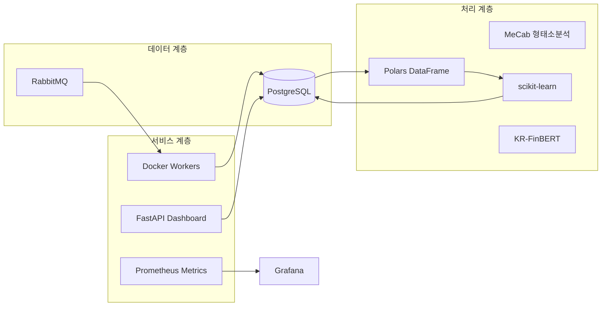
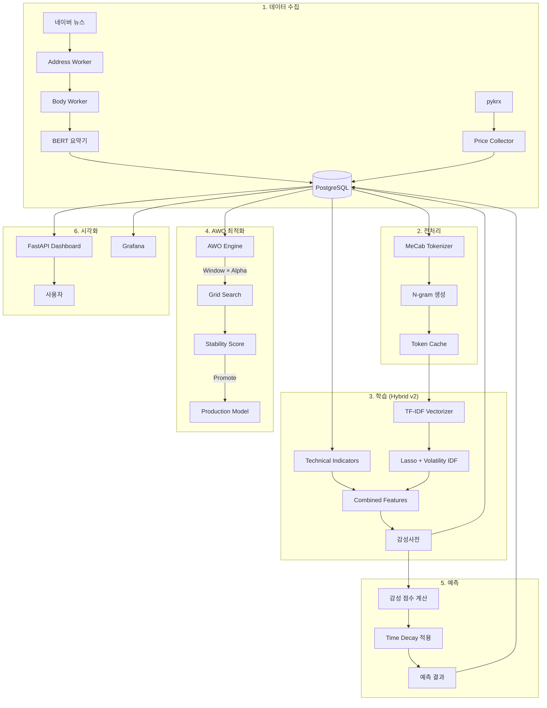
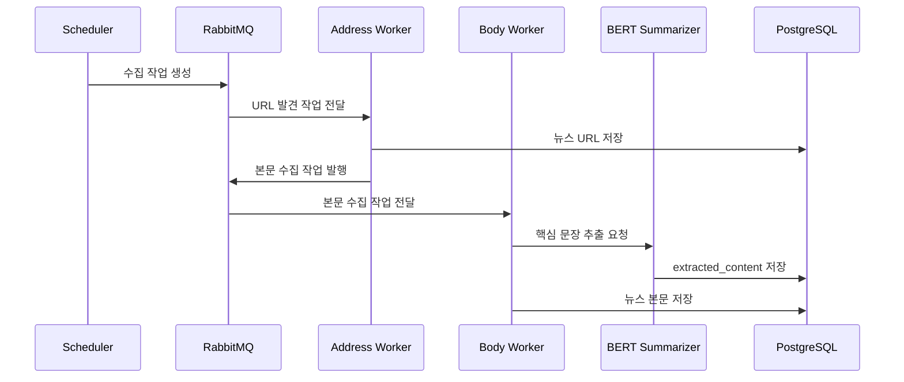
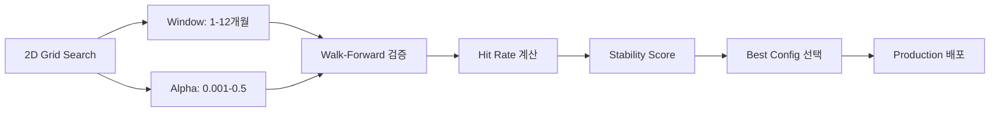

# N-SentiTrader

## 뉴스 기반 주식 감성분석 및 예측 시스템

> **교육용 화이트박스 ML 프로젝트** - 초급 개발자 양성과정 훈련생을 위한 실무 프로젝트

---

## 📋 목차
1. [프로젝트 소개](#프로젝트-소개)
2. [핵심 기능](#핵심-기능)
3. [기술 스택](#기술-스택)
4. [시스템 아키텍처](#시스템-아키텍처)
5. [핵심 워크플로우](#핵심-워크플로우)
6. [고급 기능](#고급-기능)
7. [빠른 시작](#빠른-시작)
8. [디렉토리 구조](#디렉토리-구조)
9. [교육적 설계 철학](#교육적-설계-철학)

---

## 프로젝트 소개

N-SentiTrader는 금융 뉴스의 **텍스트 마이닝**과 **머신러닝**을 활용하여 주식 시장의 감성(시장 심리)을 정량화하고, 개별 종목의 초과 수익(Alpha)을 예측하는 **자동화 시스템**입니다.

### 왜 화이트박스 모델인가?

| 구분 | 화이트박스 (본 프로젝트) | 블랙박스 (LLM 등) |
|------|-------------------------|-------------------|
| **해석 가능성** | ✅ 모든 예측 근거 확인 가능 | ❌ 내부 작동 불투명 |
| **학습 효과** | ✅ 알고리즘 원리 직접 학습 | ❌ API 호출만 학습 |
| **하드웨어 요구** | ✅ 일반 PC에서 실행 | ❌ GPU/고사양 필요 |
| **비용** | ✅ 무료 (오픈소스) | ❌ API 비용 발생 |

---

## 핵심 기능

### 🔍 데이터 수집 파이프라인
- **뉴스 수집**: 네이버 뉴스 자동 크롤링 (WARP VPN 로테이션 지원)
- **주가 수집**: pykrx 라이브러리로 OHLCV, 재무제표 수집
- **종목 마스터 자동 동기화**: 4,245개 전체 KOSPI/KOSDAQ 종목 (Naver Finance API)

### 📊 감성 분석 (TF-IDF + Lasso)
- **감성사전 자동 구축**: L1 정규화로 핵심 키워드만 추출
- **Volatility Weighted IDF**: 변동성 기반 단어 가중치 조정
- **Dynamic Lag Decay**: 뉴스 랙(지연) 적응형 감쇠율 학습
- **Stability Selection**: Bootstrap 기반 안정적 피처 선택

### 🧠 고급 모델 (Hybrid v2)
- **BERT 추출 요약**: KR-FinBERT 기반 핵심 문장 3개 자동 추출
- **기술적 지표 통합**: RSI(14), MACD, 이동평균 피처
- **앙상블 예측**: TF-IDF(60%) + BERT(40%) 가중 평균
- **MLX 가속**: Apple Silicon 네이티브 Tensor 연산 지원

### 🎯 자동 최적화 (AWO Engine)
- **2차원 그리드 서치**: Window(1\~12개월) × Alpha(0.001\~0.5)
- **병렬 처리**: ProcessPoolExecutor로 멀티코어 활용
- **체크포인트 복구**: 중단 시 자동 재개
- **안정성 스코어**: 인접 파라미터 Hit Rate 표준편차 기반

### 📈 예측 시스템
- **Time Decay 적용**: 최신 뉴스에 높은 가중치
- **Black Swan 감지**: 17개 위기 키워드 특별 처리
- **재무/기술 보조 피처**: PER, PBR, ROE, RSI, MACD 통합
- **신뢰도 지수**: 뉴스량 + 모델 MAE 기반 예측 신뢰도 계산

### 📱 대시보드
- **실시간 모니터링**: FastAPI + HTMX 반응형 UI
- **종목 자동완성**: 4,245개 전체 종목 검색 지원
- **AWO Landscape**: 3D 히트맵으로 최적 파라미터 시각화
- **Grounding 뷰**: 예측 근거 뉴스 원문 확인

---

## 기술 스택




| 영역 | 기술 | 선택 이유 |
|------|------|----------|
| **언어** | Python 3.12 | 데이터 과학 표준 언어 |
| **ML 프레임워크** | scikit-learn | 경량, 해석 가능, 교육에 적합 |
| **데이터 처리** | Polars | pandas 대비 10배 빠른 성능 |
| **형태소 분석** | MeCab | 한국어 처리 최적, 사용자 사전 지원 |
| **BERT** | KR-FinBERT | 한국어 금융 도메인 특화 |
| **API 서버** | FastAPI + HTMX | 비동기, 자동 문서화, 반응형 |
| **메시지 큐** | RabbitMQ | 분산 작업 처리, 안정성 |
| **데이터베이스** | PostgreSQL | 대용량 텍스트 처리, JSONB 지원 |
| **모니터링** | Prometheus + Grafana | 실시간 메트릭, 시각화 |
| **컨테이너** | Docker + Compose | 환경 일관성, 확장성 |

---

## 시스템 아키텍처



---

## 핵심 워크플로우

### 1️⃣ 데이터 수집 파이프라인




### 2️⃣ 감성사전 학습 프로세스 (Hybrid v2)

| 단계 | 설명 | 핵심 파라미터 |
|------|------|--------------:|
| 1. 데이터 로드 | N개월 뉴스 + 주가 데이터 | `window_months` |
| 2. 요약 추출 | BERT 기반 핵심 문장 3개 | `top_k=3` |
| 3. 토큰화 | MeCab + N-gram 생성 | `ngram_range=(1,3)` |
| 4. 벡터화 | TF-IDF + Volatility IDF | `max_features=50000` |
| 5. 기술지표 | RSI, MACD, SMA 계산 | `period=14` |
| 6. Lasso 회귀 | Stability Selection 적용 | `alpha`, `bootstrap=5` |
| 7. 사전 저장 | 상위 Top-K 단어 저장 | `top_k=100\~200` |

**Lasso 회귀 수식:**
```
minimize: ||y - Xβ||² + α||β||₁

y: 초과수익률 (Target)
X: TF-IDF + Tech Features (Combined Matrix)
β: 단어별 가중치 (감성사전)
α: L1 정규화 강도 (AWO로 최적화)
```

### 3️⃣ AWO (Adaptive Window Optimization)



- **병렬 처리**: 최대 3개 워커 프로세스 동시 실행
- **체크포인트**: 각 (Window, Alpha) 조합마다 DB 저장
- **Stability Score**: `1 - std(인접 파라미터 Hit Rate)`

---

## 고급 기능

### 📝 BERT 추출 요약기 (`NewsSummarizer`)

KR-FinBERT를 활용한 추출 요약 (Extractive Summarization):

```python
from src.nlp.summarizer import NewsSummarizer

summarizer = NewsSummarizer(use_mlx=True)  # Apple Silicon 최적화
summary = summarizer.summarize(news_text, top_k=3)

# 작동 방식:
# 1. 문단/문장 분리
# 2. BERT 임베딩 생성
# 3. 문서 중심 벡터와의 cosine similarity 계산
# 4. 상위 K개 문장 추출 (원문 순서 유지)
```

### 📊 기술적 지표 (`TechIndicatorProvider`)

```python
from src.learner.tech_indicators import TechIndicatorProvider

df = TechIndicatorProvider.fetch_and_calculate(cur, stock_code, start, end)
# 생성되는 피처:
# - tech_rsi_14: RSI(14)
# - tech_macd_line: MACD 라인
# - tech_macd_sig: MACD 시그널
# - tech_macd_hist: MACD 히스토그램
```

### 🔀 Hybrid 앙상블 (`HybridPredictor`)

```python
from src.learner.hybrid_predictor import HybridPredictor

predictor = HybridPredictor(
    tfidf_weight=0.6,  # TF-IDF Lasso 60%
    bert_weight=0.4,   # BERT Ridge 40%
    use_mlx=True
)

result = predictor.predict(news_texts)
# {
#   'tfidf_score': 0.023,
#   'bert_score': 0.018,
#   'final_score': 0.021,  # 가중 평균
#   'signal': 'BUY'
# }
```

### 🗄️ 종목 마스터 동기화

```bash
# 전체 KOSPI/KOSDAQ 종목 DB 동기화 (4,245개)
python -m src.scripts.sync_stock_master

# 결과:
# KOSPI: 2,415개
# KOSDAQ: 1,830개
```

---

## 빠른 시작

### 사전 요구사항
- Docker & Docker Compose
- Git

### 설치 및 실행

```bash
# 1. 저장소 클론
git clone https://github.com/silverwoods-dev/N-SentiTrader.git
cd N-SentiTrader

# 2. 환경 변수 설정
cp .env.sample .env
# .env 파일을 편집하여 필요한 값 입력

# 3. 컨테이너 빌드 및 실행
docker-compose up -d --build

# 4. 종목 마스터 동기화 (최초 1회)
docker exec -it n_senti_dashboard python -m src.scripts.sync_stock_master

# 5. 대시보드 접속
open http://localhost:8081
```

### 주요 URL
| 서비스 | URL | 설명 |
|--------|-----|------|
| Dashboard | http://localhost:8081 | 메인 대시보드 |
| Grafana | http://localhost:3000 | 인프라 모니터링 |
| RabbitMQ | http://localhost:15672 | 메시지 큐 관리 |
| API Docs | http://localhost:8081/docs | Swagger API 문서 |

---

## 디렉토리 구조

```
N-SentiTrader/
├── src/
│   ├── collector/              # 뉴스 수집기
│   │   └── news.py             # 메인 크롤러 (WARP VPN 지원)
│   ├── collectors/             # 보조 수집기
│   │   ├── price_collector.py  # pykrx 주가 수집
│   │   └── fundamentals_collector.py  # 재무제표 수집
│   ├── learner/                # ML 학습 모듈
│   │   ├── lasso.py            # Lasso 회귀 학습기 (49KB)
│   │   ├── awo_engine.py       # AWO 최적화 엔진 (병렬 처리)
│   │   ├── tech_indicators.py  # RSI, MACD 계산
│   │   ├── hybrid_predictor.py # TF-IDF + BERT 앙상블
│   │   └── finbert_embedder.py # KR-FinBERT 임베딩
│   ├── predictor/              # 예측 모듈
│   │   └── scoring.py          # 감성 점수 + 신뢰도 계산
│   ├── dashboard/              # FastAPI 웹 서버
│   │   ├── routers/            # API 라우터 (admin, quant)
│   │   ├── templates/          # Jinja2 + HTMX 템플릿
│   │   └── data_helpers.py     # 데이터 조회 헬퍼
│   ├── nlp/                    # 자연어 처리
│   │   ├── tokenizer.py        # MeCab + N-gram
│   │   └── summarizer.py       # BERT 추출 요약기
│   ├── utils/                  # 유틸리티
│   │   ├── mq.py               # RabbitMQ 헬퍼
│   │   ├── metrics.py          # Prometheus 메트릭
│   │   └── stock_info.py       # 종목 정보 조회
│   └── scripts/                # 실행 스크립트 (41개)
│       ├── sync_stock_master.py     # 종목 마스터 동기화
│       ├── bulk_summarize_news.py   # 일괄 BERT 요약
│       └── run_verification_worker.py  # AWO 워커
├── docker-compose.yml          # 17개 컨테이너 오케스트레이션
├── main_scheduler.py           # 작업 스케줄러
└── Dockerfile                  # 이미지 빌드 설정
```

---

## 교육적 설계 철학

### 1. 투명성 (White-Box)
모든 예측 결과에 대해 **근거가 되는 뉴스와 키워드**를 확인할 수 있습니다.
```
예측: "삼성전자 상승 예상 (+2.3%)"
근거: 
  - "금리 인하" (+0.8) - 3일 전 뉴스
  - "AI 반도체" (+0.6) - 1일 전 뉴스
  - "수출 호조" (+0.4) - 오늘 뉴스
```

### 2. 경량화
12GB RAM 환경에서 안정적으로 동작하도록 설계:
- Generator 기반 스트리밍 처리
- `min_df=3`으로 희귀 토큰 제거
- 순차적 윈도우 데이터 로딩
- 멀티프로세싱으로 메모리 격리

### 3. 모듈화
각 컴포넌트가 독립적으로 테스트 가능:
```python
# 개별 컴포넌트 테스트 예시
from src.learner.lasso import LassoLearner

learner = LassoLearner(use_summary=True, use_tech_indicators=True)
learner.run_training("005930", "2024-01-01", "2024-12-31")
```

### 4. 확장성
- **수평 확장**: Docker Compose로 워커 인스턴스 조절
- **수직 확장**: MLX/CUDA 가속 코드 경로 분리
- **플러그인 구조**: 새 지표/모델 쉽게 추가 가능

---

## 📚 추가 문서

- [API 문서](http://localhost:8081/docs) - 자동 생성 API 문서 (Swagger)

---

## 📊 주요 메트릭

| 메트릭 | 값 | 비고 |
|--------|------|------|
| 지원 종목 수 | 4,245개 | KOSPI + KOSDAQ |
| 일일 뉴스 수집량 | \~10,000건 | 활성 종목 기준 |
| AWO 스캔 시간 | \~2시간 | 8 Window × 5 Alpha |
| Hit Rate (평균) | 52\~55% | TF-IDF 모델 |
| 예측 생성 시간 | <1초 | Production 모델 |

---

## 📝 라이선스

Educational Use Only - 교육 목적으로만 사용 가능

---

*이 프로젝트는 빅데이터 분석을 위한 AI 서비스 개발자 양성과정 훈련생을 위해 제작되었습니다.*
