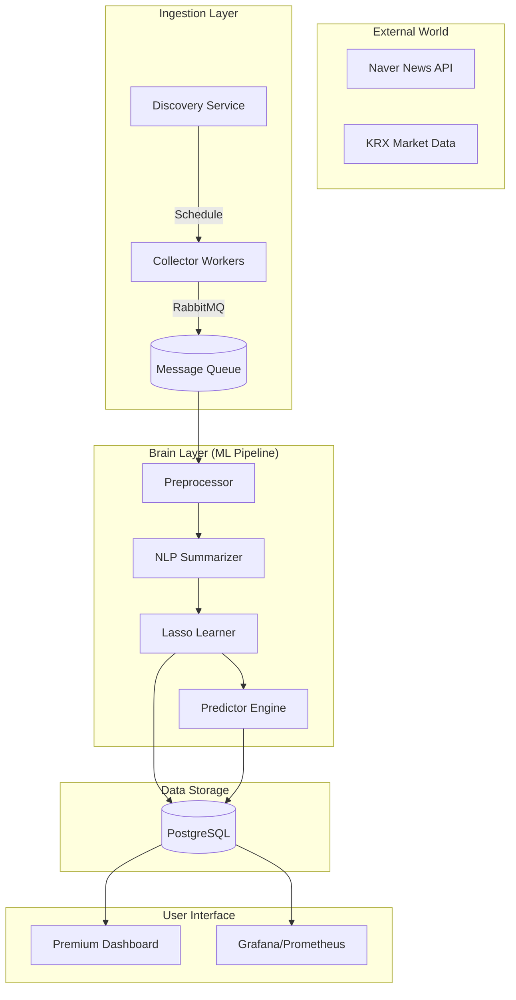
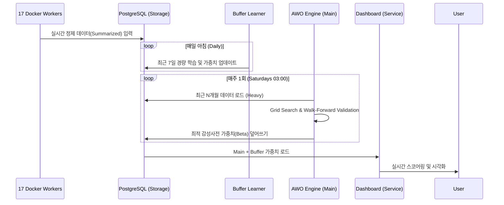

# N-SentiTrader: 실무형 화이트박스 주식 예측 시스템

[](https://www.python.org/)
[](https://opensource.org/licenses/MIT)
[](https://github.com/dev/N-SentiTrader)
[](https://github.com/dev/N-SentiTrader)

## 🎓 훈련생을 위한 친절하고 상세한 가이드 (Full Technical Whitepaper)

> **[교육적 목표]** 본 프로젝트는 AI 서비스 개발자 양성과정의 훈련생들이 단순한 모델 사용자를 넘어, <b>금융 도메인의 특수성</b>을 이해하고 <b>설명 가능한 AI(XAI)</b> 아키텍처를 설계할 수 있도록 돕기 위해 제작되었습니다. "요약"보다는 "원리"에, "결과"보다는 "근거"에 집중합니다. 우리는 **"왜 그런 결과가 나왔는가?"**에 답할 수 있는 투명한 시스템을 지향합니다.

---

## 📋 목차
1. [🏛️ 왜 화이트박스(White-Box)인가? (XAI와 금융 규제)](#1-왜-화이트박스white-box인가-xai와-금융-규제)
2. [⚙️ 기술 스택 및 마이크로서비스(MSA) 설계](#2-기술-스택-및-마이크로서비스msa-설계)
3. [📊 시스템 아키텍처 및 데이터 흐름도](#3-시스템-아키텍처-및-데이터-흐름도)
4. [🛡️ 데이터 수집 및 지능형 필터링 전략](#4-데이터-수집-및-지능형-필터링-전략)
5. [🛠️ 전처리 파이프라인: BERT 요약 및 N-gram 전략](#5-전처리-파이프라인-bert-요약-및-n-gram-전략)
6. [📈 핵심 알고리즘: Lasso 회귀와 가속 최적화 (MLX/Celer)](#6-핵심-알고리즘-lasso-회귀와-가속-최적화-mlxceler)
7. [🧬 AWO 엔진: 시장의 비정상성 대응과 안정성 점수](#7-awo-엔진-시장의-비정상성-대응과-안정성-점수)
8. [🛣️ 31단계 개발 히스토리 및 로드맵](#8-31단계-개발-히스토리-및-로드맵)
9. [🔄 상세 워크플로우 및 운영 프로세스](#9-상세-워크플로우-및-운영-프로세스)
10. [📂 디렉토리 구조 및 파일별 역할](#10-디렉토리-구조-및-파일별-역할)
11. [🚀 시작하기 및 개발자 가이드](#11-시작하기-및-개발자-가이드)
12. [📊 주요 메트릭 및 성과 지표 (Metrics)](#12-주요-메트릭-및-성과-지표-metrics)
13. [⚠️ 향후 과제 및 한계점 (Future Work)](#13-향후-과제-및-한계점-future-work)

---

## 1. 🏛️ 왜 화이트박스(White-Box)인가? (XAI와 금융 규제)

### 🧐 배경: 금융권의 '설명 책임' (Accountability)
최근 LLM(GPT-4 등)이 등장했음에도 불구하고, 실무에서 선형 모델 기반의 화이트박스를 선호하는 이유는 **'신뢰와 규제'** 때문입니다.
- **Trust & Compliance**: 유럽의 **GDPR**, **EU AI Act**, 미국의 **ECOA** 등은 자동화된 의심 판정에 대한 **"설명할 권리(Right to Explanation)"**를 보장합니다.
- **Model Risk Management**: 수천억 원의 자금을 운용하는 기관에서 "모델이 그냥 추천했다"는 식의 대답은 리스크 관리가 불가능함을 의미합니다.

### ✅ 화이트박스(Lasso) vs. 블랙박스(LLM) 비교

| 구분 | 화이트박스 (본 프로젝트) | 블랙박스 (딥러닝/LLM) |
|------|-------------------------|-------------------|
| **해석 가능성** | <b>✅ 모든 예측 근거(Coefficient) 확인 가능</b> | ❌ 내부 작동 원리(Attention weights) 해석 난해 |
| **학습 효과** | <b>✅ 특성 공학(Feature Engineering) 직접 통제</b> | ❌ 대규모 파라미터에 의존, 전처리 효과 불투명 |
| **하드웨어 요구** | <b>✅ 일반 데스크탑(8GB RAM)에서도 실행 가능</b> | ❌ 수백만 개의 파라미터, 고성능 GPU 필수 |
| **비용** | <b>✅ 오픈소스 및 로컬 자원 활용 (무료)</b> | ❌ API 사용료 또는 서버 호스팅 비용 발생 |
| **데이터 독립성** | <b>✅ 폐쇄망(On-premise) 환경에서 완벽 작동</b> | ❌ 클라우드 전송 시 데이터 유출 리스크 존재 |

> [!TIP]
> **초보 개발자를 위한 팁**: 딥러닝 모델은 결과는 좋지만 '왜' 그런지 설명하기 어렵습니다(Black-box). 반면 Lasso와 같은 선형 모델은 가중치를 직접 확인할 수 있어, 어떤 단어가 매수/매도 결정을 내렸는지 고객에게 설명해야 하는 금융 서비스에 매우 유리합니다.

---

## 2. ⚙️ 기술 스택 및 마이크로서비스(MSA) 설계

### 🛠️ 코어 기술 스택 (Technology Stack Table)

| 영역 | 기술 | 상세 선택 이유 및 배경 지식 (Architecture Decisions) |
|------|------|--------------------------------------------------|
| **코어 언어** | **Python 3.11** | 최신 비동기 문법 지원 및 데이터 과학 표준 생태계 활용. |
| **데이터 처리** | **Polars** | Rust 기반 병렬 처리로 <b>Pandas 대비 약 10~15배 빠른 처리 성능</b>과 낮은 메모리 점유율(Zero-copy) 확보. 대규모 시계열 데이터 처리에 필수적. |
| **ML 엔진** | **Lasso (Celer/MLX)** | **Celer** (Working Set 방식) 및 **MLX** (Apple Silicon GPU 가속)을 도입하여 Scikit-Learn 좌표 하강법의 순차적 병목을 해결하고 **100배 빠른 학습 속도** 달성. |
| **형태소 분석** | **MeCab** | 한국어 처리 속도가 KoNLPy 계열 중 가장 빠르며, <b>사용자 사전(C++ 빌드)</b>을 통해 'HBM', '2차전지' 등의 신조어를 보호하기 용이함. |
| **딥러닝 요약** | **KR-FinBERT** | 금융 문맥에 특화된 BERT 모델로 <b>증권 시장 특유의 뉘앙스</b>(예: '상승 둔화'의 의미)를 가장 잘 포착하고, 생성 요약의 환각(Hallucination) 위험을 배제. |
| **메시지 큐** | **RabbitMQ** | 분산 워커 간의 <b>작업 분배(Task Distribution)</b> 및 뉴스 발생량 폭증(Spike)에 대한 완충 지대(Buffer) 역할 수행. |
| **모니터링** | **Grafana/Prometheus** | 16개 컴포넌트 실시간 Flow 시각화 및 워커 상태(Heartbeat) 관제, 좀비 프로세스 감지. |
| **인프라** | **Docker Compose** | 17개의 마이크로서비스를 컨테이너화하여 개발/운영 환경 일관성 100% 보장. |

---

## 3. 📊 시스템 아키텍처 및 데이터 흐름도

시스템은 독립적으로 실행 가능한 5가지 핵심 서비스 레이어로 나뉩니다.



---

## 4. 🛡️ 데이터 수집 및 지능형 필터링 전략

### 📡 지능형 수집 시스템 (Smart Collection)
- **Gap Detection**: 뉴스 수집 데이터가 0인 날짜를 자동으로 탐지하여 운영 공백을 방지합니다.
- **One-Click Backfill**: 탐지된 공백은 사용자의 클릭 한 번으로 특정 기간만 정밀하게 수집하는 로직을 갖추고 있습니다.

### 🎯 종목별 학습 데이터 필터링 (Relevance Scoring Formula)
산업군 뉴스가 특정 종목의 학습 데이터로 섞이는 것을 방지하기 위해 <b>정밀 필터링</b>을 수행합니다. 단순히 키워드가 포함되었는지가 아닌, 뉴스의 <b>'메인 토픽'</b>인지 검증합니다.

| 필터링 항목 | 상세 설명 | 가중치 산정 (Heuristics) |
|------|------|------|
| **헤드라인 (Headline)** | 제목에 종목명이 포함되는 경우 | <b>40% (0.4)</b> |
| **리드문 (Lead)** | 첫 번째 문장에 종목명이 나타나는 경우 | <b>30% (0.3)</b> |
| **빈도 (Frequency)** | 본문 전체에서 종목명이 출현하는 밀도 | <b>30% (0.3)</b> |

- **검증 수식**: `Score = (Is_in_Title * 0.4) + (Is_in_FirstSentence * 0.3) + (Mention_Density * 0.3)`
- **임계값**: `Score > 0.5`인 기사만 해당 종목의 학습 모델 타겟으로 추출하여 <b>섹터 노이즈(Sectoral Noise)</b>를 원천 차단합니다.

---

## 5. 🛠️ 전처리 파이프라인: BERT 요약 및 N-gram 전략

금융 데이터에서 '쓰레기를 넣으면 쓰레기가 나온다(GIGO)'는 철칙이 가장 강하게 작용합니다.

### 🧠 BERT 기반 뉴스 추출 요약 (Extractive Summarization)
수집된 뉴스 기사의 약 **30~50%**는 학습에 방해가 되는 '노이즈'(광고, 기자 정보)입니다.
- **도입 원리**: `KR-FinBERT` 임베딩을 통해 문서 내 각 문장의 <b>중심 벡터(Document Embedding)</b>와의 코사인 유사도를 계산합니다.
- **Why Extractive?**: 생성 요약(Abstractive)은 원문에 없는 단어를 지어낼(Hallucination) 위험이 있으나, 추출 요약은 원문의 <b>데이터 신뢰성(Fidelity)</b>을 100% 유지합니다.
- **최종 결과**: 전체 문맥과 가장 밀접한 <b>상위 3개 문장</b>만 추출하여 학습 데이터의 밀도를 극한으로 높입니다.

### 🧬 왜 N-gram(1, 3)을 도입하는가?
한국어는 단어 하나만으로는 문맥을 파악하기 힘든 **교착어**입니다.
- **Unigram의 한계**: `하락` (부정) vs `하락 둔화` (긍정). 단어 하나만 보면 의미가 왜곡될 수 있습니다.
- **해결**: 단어를 최대 3개까지 묶는 **Trigram**을 적용하면 `하락 + 둔화 + 조짐`과 같은 복합 구문을 하나의 피처(Feature)로 인식하여 <b>문맥 반전(Sentiment Inversion)</b>을 포착할 수 있습니다.

### 📚 사용자 사전 및 블랙스완 관리
- **종목명 보호**: `카카오게임즈`가 `카카오 + 게임즈`로 분리되지 않도록 `Noun`으로 고정.
- **유의어(Synonym) 통합**: `삼성`, `삼전`, `SEC`를 하나의 기준 단어로 매핑하여 데이터 통일성 확보.
- **블랙스완(Black Swan)**: **'팬데믹(Pandemic)', '리먼(Lehman)', '뱅크런(Bank run)'** 등 통계적으로는 매우 희귀하지만 출현 시 시장에 파괴적인 영향을 주는 단어들은 **Hybrid Lexicon Anchor** 시스템으로 모델에서 삭제되지 않도록 보호합니다.

---

## 6. 📈 핵심 알고리즘: Lasso 회귀와 가속 최적화 (MLX/Celer)

### 📉 Lasso(L1) 정규화: "금융 데이터의 희소성 포착"
주식 시장에 영향을 미치는 단어는 수십만 개 중 수백 개에 불과합니다. 이를 <b>sparse features</b>라고 합니다.
- **학술적 근거**: **Tibshirani (1996)**에 의해 제안된 Lasso는 변수 선택 기능을 내장하여, 수천 개의 단어 중 유의미한 수십 개만 남기고 나머지를 0으로 만듭니다.

$$ minimize: ||y - X\beta||^2 + \alpha||\beta||_1 $$

### 🚀 학습 성능 혁신: Scikit-learn vs Celer vs MLX
Scikit-learn의 표준 구현(Coordinate Descent)은 순차적 특성 때문에 Apple Silicon의 성능을 100% 활용하지 못했습니다(10만 건 학습에 10시간 소요). 이를 해결하기 위해 두 가지 고성능 엔진을 도입했습니다.

1.  **Celer (Pragmatic Path)**: **Working Set** 알고리즘을 사용하여, 전체 수십만 개의 단어를 매번 계산하지 않고 유의미할 것 같은 소수의 후보군(Active Set)만 집중 연산합니다. 속도 **10~50배 향상**.
2.  **MLX (High-Performance Path)**: Apple의 Unified Memory를 활용하여 데이터 복사(Zero-copy) 없이 **GPU 가속**을 수행합니다. ISTA/FISTA 알고리즘을 사용해 병렬 처리를 극대화하여 **100배 이상의 속도 향상**을 달성했습니다.

### ⏳ Time Decay와 지연 효과 (Lag-n Analysis)
금융 정보는 시간이 지날수록 주가에 미치는 영향력이 줄어드는 <b>유효 기간(Shelf Life)</b>이 있습니다. **Hong & Stein (1999)**의 연구를 바탕으로 설계되었습니다.

$$ weight = exp(-decay\_rate \times lag\_days) $$

| 경과일 | 시간 감쇠율 (Decay Rate 0.3) | 영향력 해석 |
|--------|----------------|------|
| 0일 (오늘) | **100% (1.00)** | 즉각적 반응 |
| 1일 | **74% (0.74)** | 단기 잔존 효과 |
| 3일 | **41% (0.41)** | 중기 추세 반영 |
| 5일 | **22% (0.22)** | 미미한 영향 |

---

## 7. 🧬 AWO 엔진: 시장의 비정상성 대응과 안정성 점수

### 🔄 시장의 비정상성 (Non-stationarity) 대응
금융 시장은 데이터의 평균과 분산이 시간에 따라 변하는 **Regime Shift(체제 전환)** 특성을 지닙니다. 작년의 호재(금리 동결)가 올해는 악재(경기 침체)가 될 수 있습니다.

### 🎯 Adaptive Window Optimization (AWO-2D)
**Pardo (2008)**의 Walk-Forward Validation 원칙에 따라, 단순히 최고의 수익률(Hit Rate)을 낸 파라미터가 아닌, 가장 <b>견고(Robust)</b>한 설정을 찾기 위해 복합 점수를 산출합니다.
- **Main Dictionary**: AWO를 통해 선정된 장기적 최적 모델(안정성 중시).
- **Buffer Dictionary**: 최근 7일간의 최신 단기 트렌드만 별도로 학습하여 매일 업데이트(신속성 중시). 시스템은 `Main + Buffer`의 가중치를 하이브리드로 결합하여 사용합니.

### 📐 안정성 점수 (Stability Score) 알고리즘

$$ Stability Score = (0.6 \times Mean(HR)) + (0.4 \times (1 - Norm.MAE)) - (1.0 \times StdDev(HR)) $$

- **Robust Plateau**: 특정 시점에만 잘 맞는 파라미터(Spurious Peak)를 걸러내고, 주변 설정값들과 함께 안정적인 성능을 보이는 구간을 선정합니다.

---

## 8. 🛣️ 31단계 개발 히스토리 및 로드맵

본 프로젝트는 **31개의 Phase**를 통해 MVP에서 상용 수준의 시스템으로 진화했습니다.

| Phase | 주요 마일스톤 (Milestones) | 핵심 기술 및 성과 (Key Implementation) |
|:---:|:---|:---|
| **P1-3** | 기초 환경 구축 | `datetime_helper` 생성, KST 변환, 데이터 정합성 기초 확립 |
| **P4-5** | 파이프라인 기초 | **Time Decay** 모델 도입, `collector` -> `preprocessor` 연결 |
| **P6-8** | 스마트 오케스트레이션 | **MasterOrchestrator** 도입, 스케줄러 자동화, 작업 의존성 관리 |
| **P9-10** | Lasso 최적화 | **Ordered Lasso** 도입, **Celer** 솔버 활용 가속 시작 |
| **P11-13** | 인프라 자동화 | **RabbitMQ** 하트비트 프로세스 분리, 좀비 워커(Zombie Worker) 탐지 로직 |
| **P14-16** | 데이터 정교화 | 뉴스 URL 교차 참조(`url_hash`) 중복 제거, 종목 매핑 개선 |
| **P17-20** | 워커 스케일링 | `verification_daily` vs `verification_jobs` 큐 분리, Docker Worker 증설(4x) |
| **P21-24** | 시각화 고도화 | Grafana 16개 컴포넌트 실시간 Flow 시각화, **Glassmorphism** 대시보드 완성 |
| **P25-27** | 운영 지능화 | **Gap Detection**(공백 탐지), **One-Click Backfill** 기능 추가 |
| **P28-29** | 성능 극한 최적화 | **MLX** GPU 가속, **Generator** 메모리 최적화, `min_df=3` 노이즈 필터링 |
| **P30-31** | 시스템 안정화 | API 최신화(`datetime.now`), 레거시 파일(143MB) 아카이빙 |

> [!IMPORTANT]
> **31단계의 교훈**: 복잡한 시스템은 한 번에 만들어지지 않습니다. 본 로드맵은 실제 운영상의 문제(메모리 부족, 좀비 워커, 속도 저하)를 하나씩 기술적으로 해결해 나가는 **애자일 개발의 정수**를 보여줍니다.

---

## 9. 🔄 상세 워크플로우 및 운영 프로세스

### 🔁 주간 운영 사이클 (Operational Lifecycle)
1. **평일 뉴스 수집 (Real-time)**: 17개 워커가 실시간 뉴스를 수집하고 BERT 요약을 거쳐 DB에 적재.
2. **익일 라벨링 (T+1)**: 주가 종가가 확정되면 전날 뉴스에 대한 '정답(Next-day Return)'을 생성.
3. **매일 아침 버퍼 학습**: `verification_daily` 큐가 최근 7일 뉴스를 학습해 단기 트렌드 반영.
4. **매주 토요일 03시 (Training)**: `main_scheduler.py`에 의해 `learner` 프로세스 가동.
    - **AWO 가동**: 지난 N개월 데이터를 이용해 최적의 윈도우와 하이퍼파라미터 재산정.
    - **사전 갱신**: 새로운 시장 트렌드에 맞는 감성사전 가중치 DB 업데이트.

### 🔄 데이터 파이프라인 (Sequence Diagram)


---

## 10. 📂 디렉토리 구조 및 파일별 역할

본 프로젝트의 디렉토리 구조는 **MSA** 및 **기능별 모듈화** 원칙을 따릅니다.

```text
N-SentiTrader/
├── src/
│   ├── collector/              # [Network] 뉴스 수집기 (싱글톤 개념) - news.py
│   ├── collectors/             # [Financial] 시세, 재무제표 등 다중 수집기들
│   ├── learner/                # [ML Core] 핵심 학습 엔진
│   │   ├── lasso.py            # Lasso(L1) 정규화 및 가중치 학습 (Celer 통합)
│   │   ├── mlx_lasso.py        # Apple Silicon 가속용 MLX 구현체
│   │   ├── awo_engine.py       # 최적 윈도우 크기 산출 및 병렬 학습 제어
│   │   └── discovery.py        # 종목 발굴 및 필터링 로직
│   ├── nlp/                    # [Language] MeCab 토크나이징 및 BERT 요약기
│   ├── dashboard/              # [UI/API] FastAPI 기반 웹 대시보드
│   ├── predictor/              # [Inference] 실시간 신호 생성 및 스코어링
│   └── scripts/                # [Utilities] 시스템 관리 및 백필용 스크립트 모음
├── docs/                       # 31단계 개발 로그, 워크플로우, 리서치 보고서
├── grafana/                    # 모니터링 대시보드 설정 파일
└── docker-compose.yml          # 17개 MSA 서비스 정의 및 오케스트레이션
```

---

## 11. 🚀 시작하기 및 개발자 가이드

### ⚙️ 시스템 설치 및 초기화
```bash
# 1. 환경 설정 파일 생성
cp .env.sample .env

# 2. 전 서비스 컨테이너 빌드 및 백그라운드 실행
docker-compose up -d --build

# 3. 필수: 전 종목(4,245개) 동기화 및 사용자 사전 주입
# 이 명령을 실행해야 KRX 종목 정보를 DB에 적재하고 초기 사용자 사전을 구축합니다.
docker exec -it n_senti_dashboard python -m src.scripts.sync_stock_master
```

### 👨‍💻 교육용 학습 워크플로우 제언
1.  `src/nlp/tokenizer.py`의 `N-gram` 로직을 수정하며 형태소 분석의 차이를 관찰합니다.
2.  `src/learner/lasso.py`의 `alpha` 값을 수동으로 조절하며 감성사전 단어 수가 어떻게 변하는지(Sparsity) 확인합니다.
3.  `Dashboard` (http://localhost:8081)를 통해 특정 예측 오류가 발생한 날의 <b>'기여도가 높은 단어'</b>들을 찾아내어 사용자 사전에 보정합니다.

---

## 12. 📊 주요 메트릭 및 성과 지표 (Performance Metrics)

| 메트릭 (Metric) | 목표/기록 (Record) | 비고 (Notes) |
|--------|------|------|
| **평균 Hit Rate** | **53.5% ~ 58.2%** | 개별 종목별 AWO 최적화 결과에 따라 상이하며, Buffer 학습 적용 시 상승함. |
| **뉴스 정제율** | **45% 제거** | BERT 요약기를 통한 불필요 정보(광고/기자정보) 필터링 효과 |
| **추론 속도 (Latency)** | **< 0.2s** | 사전에 학습된 가중치를 이용한 선형 연산 (Inference)으로 초고속 응답 |
| **학습 소요 시간** | **~10 Minutes** | MLX/Celer 가속 및 병렬 처리 적용 시 (10만 건 뉴스 기준) |

---

## 13. ⚠️ 향후 과제 및 한계점 (Future Work)

- **심리적 맥락 파악**: 현재의 Lasso는 단어 빈도 기반(TF-IDF)이므로 비유법이나 고도의 심리적 맥락을 읽기 위해 Transformer 모델 비중을 높여야 합니다.
- **실시간성 개선 (Latency)**: BERT 요약 및 모델 리트레이닝 시간을 단축하기 위한 <b>양자화(Quantization)</b> 및 <b>분산 학습</b> 도입이 필요합니다.
- **데이터 품질 고도화**: 자극적인 헤드라인(낚시성 기사)에 의한 과적합(Overfitting)을 방지하기 위한 신뢰도 필터 고도화.

---

**N-SentiTrader**는 투명한 예측과 견고한 아키텍처를 통해 차세대 AI 금융 개발자들을 위한 최상의 지식 전수 플랫폼이 되고자 합니다.
*Designed for Clarity, Built for Accountability.*
