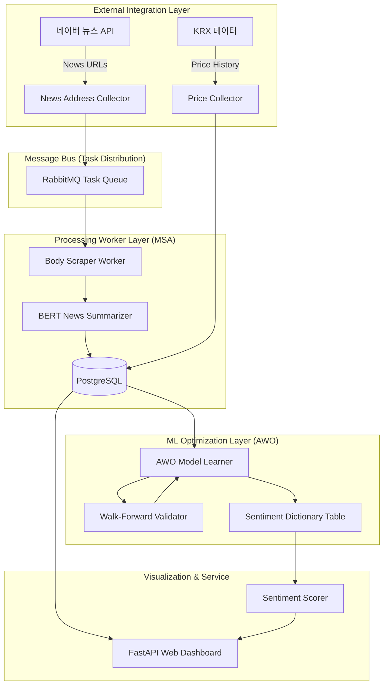
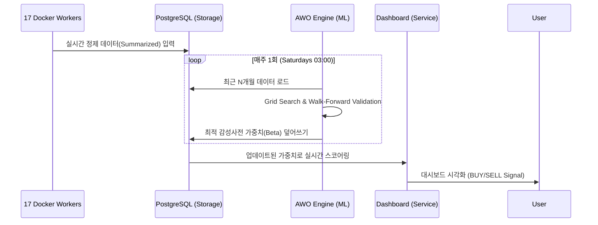

# N-SentiTrader: 실무형 화이트박스 주식 예측 시스템

## 🎓 훈련생을 위한 기술 백서 및 상세 가이드 (Comprehensive Whitepaper)

> **[교육적 목표]** 본 프로젝트는 AI 서비스 개발자 양성과정의 훈련생들이 단순한 모델 사용자를 넘어, **금융 도메인의 특수성**을 이해하고 **설명 가능한 AI(XAI)** 아키텍처를 설계할 수 있도록 돕기 위해 제작되었습니다. "요약"보다는 "원리"에, "결과"보다는 "근거"에 집중하여 <b>생략 없는 구체적 기술 상세</b>를 제공합니다.

---

## 📋 목차
1. [🏛️ 왜 화이트박스(White-Box)인가? (XAI와 금융 규제)](#1-왜-화이트박스white-box인가-xai와-금융-규제)
2. [⚙️ 기술 스택 및 마이크로서비스(MSA) 설계](#2-기술-스택-및-마이크로서비스msa-설계)
3. [📊 시스템 아키텍처 및 데이터 흐름도](#3-시스템-아키텍처-및-데이터-흐름도)
4. [🛠️ 전처리 파이프라인: BERT 요약 및 데이터 필터링 전략](#4-전처리-파이프라인-bert-요약-및-데이터-필터링-전략)
5. [🧠 NLP 전략: N-gram, 사용자 사전, 블랙스완 관리](#5-nlp-전략-n-gram-사용자-사전-블랙스완-관리)
6. [📈 핵심 알고리즘: Lasso 회귀, Time Decay, Lag 시계열](#6-핵심-알고리즘-lasso-회귀-time-decay-lag-시계열)
7. [🧬 AWO 엔진: 비정상성과 체제 전환(Regime Shift) 대응](#7-awo-엔진-비정상성과-체제-전환regime-shift-대응)
8. [🔄 상세 워크플로우 및 운영 프로세스](#8-상세-워크플로우-및-운영-프로세스)
9. [📂 디렉토리 구조 및 파일별 역할 상세](#9-디렉토리-구조-및-파일별-역할-상세)
10. [🚀 시작하기 및 개발자 가이드](#10-시작하기-및-개발자-가이드)
11. [⚠️ 향후 과제 및 한계점](#11-향후-과제-및-한계점)

---

## 1. 🏛️ 왜 화이트박스(White-Box)인가? (XAI와 금융 규제)

### 🧐 배경: 금융권의 '설명 책임' (Accountability)
금융 시장에서 AI 모델의 판단은 수십억 원의 자산 가치를 좌우합니다. 최근 LLM(GPT-4 등)이 등장했음에도 불구하고, 실무에서 선형 모델 기반의 화이트박스를 선호하는 이유는 **'신뢰와 규제'** 때문입니다.

- **규제 준수 (Regulatory Compliance)**: 
    - 유럽의 **GDPR** 및 **EU AI Act**는 자동화된 결정에 대한 <b>"설명할 권리(Right to Explanation)"</b>를 보장합니다.
    - 미국의 **ECOA** 및 **FCRA**는 대출 심사나 금융 판정 시 "왜 이 결과가 나왔는가?"에 대한 구체적 사유(Adverse Action Notice)를 요구합니다.
    - 블랙박스 모델은 "확률적 통계"라고 답하지만, 화이트박스 모델은 "A라는 키워드의 가중치가 B만큼 작용했다"는 <b>수리적 근거</b>를 제공합니다.
- **리스크 관리 (Model Risk Management)**: 금융 보안 및 심사 분야에서는 모델의 가중치를 직접 검토하여 <b>알고리즘 편향(Bias)</b>이나 <b>데이터 편향</b>이 없는지 주기적으로 감사(Audit)해야 합니다.

### ✅ 화이트박스(Lasso) vs. 블랙박스(LLM) 비교

| 구분 | 화이트박스 (본 프로젝트) | 블랙박스 (LLM/Transformer 등) |
|------|-------------------------|-------------------|
| **해석 가능성** | <b>✅ 모든 예측 근거(Coefficient) 확인 가능</b> | ❌ 내부 작동 원리(Attention weights) 해석 난해 |
| **학습 효과** | <b>✅ 특성 공학(Feature Engineering) 직접 통제</b> | ❌ 대규모 파라미터에 의존, 전처리 효과 불투명 |
| **하드웨어 요구** | <b>✅ 일반 데스크탑(8GB RAM)에서도 실행 가능</b> | ❌ 수백만 개의 파라미터, 고성능 GPU 필수 |
| **비용** | <b>✅ 오픈소스 및 로컬 자원 활용 (무료)</b> | ❌ API 사용료 또는 서버 호스팅 비용 발생 |
| **데이터 독립성** | <b>✅ 폐쇄망(On-premise) 환경에서 완벽 작동</b> | ❌ 클라우드 전송 시 데이터 유출 리스크 존재 |

---

## 2. ⚙️ 기술 스택 및 마이크로서비스(MSA) 설계

### 🛠️ 코어 기술 스택 (Technology Stack Table)

| 영역 | 기술 | 상세 선택 이유 및 배경 지식 (Architecture Decisions) |
|------|------|--------------------------------------------------|
| **코어 언어** | **Python 3.12** | 최신 비동기 문법 지원 및 데이터 과학 표준 생태계 활용. |
| **데이터 처리** | **Polars** | Rust 기반 병렬 처리로 <b>Pandas 대비 약 10~15배 빠른 처리 성능</b> 및 낮은 메모리 점유율 확보. |
| **ML 엔진** | **scikit-learn** | Lasso(L1), Ridge(L2) 정규화 등 <b>해석 가능한 ML 알고리즘</b>의 표준 구현체. |
| **형태소 분석** | **MeCab** | 한국어 처리 속도가 가장 빠르며(KoNLPy 중), <b>사용자 사전(C++ 빌드)</b>을 통한 전문 용어 보호 용이. |
| **딥러닝 요약** | **KR-FinBERT** | 금융 문맥에 특화된 BERT 모델로 <b>증권 시장 특유의 뉘앙스</b>(예: '상승 둔화'의 의미)를 가장 잘 포착. |
| **API 서비스** | **FastAPI** | 비동기 I/O를 통한 고성능 서빙 및 Pydantic 기반의 <b>강력한 데이터 유효성 검사</b> 및 Swagger 자동화. |
| **메시지 큐** | **RabbitMQ** | 분산 워커 간의 <b>작업 분배(Task Distribution)</b> 및 갑작스러운 수집량 증가에 대한 완충 지대(Buffer) 역할. |
| **컴퓨팅** | **Docker Compose** | 17개의 마이크로서비스를 <b>컨테이너화(Containerization)</b>하여 개발 환경과 운영 환경의 일관성을 100% 보장. |

---

## 3. 📊 시스템 아키텍처 및 데이터 흐름도

시스템은 독립적인 기능 단위로 쪼개진 <b>마이크로서비스 아키텍처(MSA)</b>를 지향합니다.

### 🏗️ 전체 시스템 흐름도 (Full System Flowchart)


---

## 4. 🛠️ 전처리 파이프라인: BERT 요약 및 데이터 필터링 전략

금융 데이터에서 '쓰레기를 넣으면 쓰레기가 나온다(GIGO)'는 철칙이 가장 강하게 작용합니다.

### 🧠 BERT 기반 뉴스 추출 요약 (`News Summarization`)
수집된 뉴스 기사의 약 **30~50%**는 학습에 방해가 되는 '노이즈'입니다.
- **문제점**: 뉴스 하단의 기자 연락처, 광고성 문구, 사진 설명, 지난 기사 링크 등.
- **해결책**: `KR-FinBERT` 임베딩을 통해 문서 내 각 문장의 <b>중심 벡터(Document Embedding)</b>와의 코사인 유사도를 계산합니다.
- **최종 결과**: 전체 문맥과 가장 밀접한 <b>상위 3개 문장(Global Importance)</b>만 추출하여 학습 데이터의 밀도를 극한으로 높입니다.

### 🎯 종목별 학습 데이터 필터링 (Relevance Scoring)
산업군 뉴스가 특정 종목의 학습 데이터로 섞이는 것을 방지하기 위해 <b>정적/동적 필터링</b>을 수행합니다.

| 필터링 항목 | 상세 설명 | 검증 방법 (Verification) |
|------|------|------|
| **종목 이름 존재** | 뉴스 본문에 해당 종목명이 정확히 출현하는가? | MeCab 사용자 사전 매칭 |
| **연관성 점수** | 제목(40%), 첫 문장(30%), 빈도수(30%) 가중치 계산 | `Score > 0.5` 모델링 타겟팅 |
| **업종군 노이즈** | 다른 종목의 이름이 더 많이 언급되는가? | Multi-Stock Relevance Competition |

---

## 5. 🧠 NLP 전략: N-gram, 사용자 사전, 블랙스완 관리

### 🧬 왜 N-gram(1, 3)을 도입하는가?
한국어는 단어 하나만으로는 문맥을 파악하기 힘든 <b>교착어(Agglutinative Language)</b>입니다.
- **Unigram의 한계**: `하락`이라는 단어는 부정적으로 수렴하지만, <b>`하락 둔화`</b>는 기술적 반등의 신호로 매우 긍정적입니다.
- **해결**: 단어를 최대 3개까지 묶는 **Trigram**을 적용하면 `하락 + 둔화 + 조짐`과 같은 복합 구문을 하나의 피처(Feature)로 인식하여 문맥 반전(Sentiment Inversion)을 포착할 수 있습니다.

### 📚 사용자 사전(User Dictionary) 관리의 가치
형태소 분석기(MeCab)가 신기술 용어나 종목명을 쪼개지 않도록 관리하는 것은 모델 성능의 핵심입니다.
- **종목명/제품명 보호**: `카카오게임즈`가 `카카오 + 게임즈`로 분리되지 않도록 `Noun`으로 고정.
- **동음이의어 관리**: '사과(Apology)'와 '사과(Apple)'가 금융 맥락에서 혼동되지 않도록 매핑.
- **블랙스완(Black Swan) 단어**: <b>'팬데믹', '리먼', '뱅크런'</b> 등 통계적으로는 매우 희귀(Sparsity)하지만 출현 시 시장에 파괴적인 영향을 주는 단어들을 **전문 용어 사전**으로 관리하여 가중치를 보존합니다.

---

## 6. 📈 핵심 알고리즘: Lasso 회귀, Time Decay, Lag 시계열

### 📉 Lasso(L1) 정규화: "금융 데이터의 희소성 포착"
주식 시장에 영향을 미치는 단어는 수십만 개 중 수백 개에 불과합니다. 이를 <b>sparse features</b>라고 합니다.
- **수식 (Objective Function)**:
  $$ \min_{\beta} \left( \|y - X\beta\|^2_2 + \alpha \|\beta\|_1 \right) $$
- **작동 원리**: $\alpha$ 값이 커질수록 영향력이 적은 단어의 가중치($\beta$)를 **정확히 0**으로 만듭니다.
- **효과**: 불필요한 단어들이 자동으로 제거되어 <b>'가장 파괴력 있는 단어'</b>들로 구성된 투명한 감성사전이 구축됩니다.

### ⏳ Time Decay와 지연 효과 (Lag-n Analysis)
금융 정보는 시간이 지날수록 주가에 미치는 영향력이 줄어드는 <b>유효 기간(Shelf Life)</b>이 있습니다.
- **Time Decay 함수**:
  `Weight = exp(-decay_coefficient * delay_days)`
- **지연 효과(Lag Feature)의 이유**:
    - 시장은 즉각 반응하기도 하지만, 대규모 공시나 거시 경제 뉴스는 시장 참가자들이 소화하는 데 <b>1~3일의 지연 반영(Lag Effect)</b>이 발생합니다.
    - 본 프로젝트는 D-day의 주가를 예측하기 위해 **D-1, D-2, D-3일**의 뉴스를 가중합산하여 유의미한 영향력 범위를 결정합니다.

---

## 7. 🧬 AWO 엔진: 비정상성과 체제 전환(Regime Shift) 대응

### 🔄 시장의 비정상성 (Non-stationarity) 대응
금융 시장은 데이터의 평균과 분산이 시간에 따라 변하는 <b>비정상성</b>인 특성을 지닙니다. 작년의 "금리 인하"는 호재였으나, 경기 침체기인 올해는 공포의 시작일 수 있습니다. 이를 **Regime Shift(체제 전환)**라 부릅니다.

### 🎯 Adaptive Window Optimization (AWO) 프로세스
단 하나의 윈도우 크기(학습 기간)를 고집하지 않고, 시장 상황에 맞는 최신 패턴을 검색합니다.
- **2D 그리드 서치**: 윈도우 크기(3~12개월)와 규제 강도($\alpha$)를 조합하여 수만 번의 학습 실행.
- **Walk-Forward Validation**: 데이터를 시간 순서대로 전진하며 검증하여 <b>미래 예측 편향(Look-ahead Bias)</b>을 원천 차단.
- **Stability Score (안정성 점수)**: 단순히 최고 성능이 아닌, 인접 파라미터 변화에도 성능이 안정적으로 유지되는 <b>강건한(Robust)</b> 최적점을 선택합니다.

---

## 8. 🔄 상세 워크플로우 및 운영 프로세스

### 🔁 주간 운영 사이클 (Operational Lifecycle)
1. **평일 뉴스 수집 (Real-time)**: 17개 워커가 실시간 뉴스를 수집하고 BERT 요약을 거쳐 DB에 적재.
2. **익일 라벨링 (T+1)**: 주가 종가가 확정되면 전날 뉴스에 대한 '정답(Next-day Return)'을 생성.
3. **매주 토요일 03시 (Training)**: `main_scheduler.py`에 의해 `learner` 프로세스 가동.
    - **AWO 가동**: 지난 N개월 데이터를 이용해 최적의 윈도우와 하이퍼파라미터 재산정.
    - **사전 갱신**: 새로운 시장 트렌드에 맞는 감성사전 가중치 DB 업데이트.

### 🔄 3-File System (3FS) 데이터 파이프라인


---

## 9. 📂 디렉토리 구조 및 파일별 역할 상세

```text
N-SentiTrader/
├── src/
│   ├── collector/              # [Network] 뉴스 URL 수집 및 RabbitMQ 분배
│   ├── collectors/             # [Financial] 종가(Price), 재무(Fundamental) 수집기
│   ├── learner/                # [ML Core]
│   │   ├── lasso.py            # Lasso(L1) 정규화 및 가중치 학습 엔진
│   │   ├── awo_engine.py       # 최적 윈도우 크기 산출 및 병렬 학습 제어
│   │   ├── tech_indicators.py  # RSI, MACD 등 기술적 지표 피처 생성
│   │   └── hybrid_predictor.py # 텍스트 감성 + 차트 지표 앙상블 모델
│   ├── predictor/              # [Inference] 실시간 감성 점수 계산 및 신호 생성
│   ├── dashboard/              # [UI/API] FastAPI 기반 모니터링/시각화 서버
│   ├── nlp/                    # [Language] MeCab 토크나이징 및 BERT 요약 처리
│   └── utils/                  # [System] MQ 핸들링, DB 연결, 프로메테우스 메트릭
├── docker-compose.yml          # 17개 MSA 서비스 정의 및 오케스트레이션
├── main_scheduler.py           # 전체 시스템의 심장 (스케줄 관리)
└── README.md                   # 본 기술 백서
```

---

## 10. 🚀 시작하기 및 개발자 가이드

### ⚙️ 시스템 설치 및 초기화
```bash
# 1. 환경 설정 파일 생성
cp .env.sample .env

# 2. 전 서비스 컨테이너 빌드 및 백그라운드 실행
docker-compose up -d --build

# 3. 필수 상식: 전 종목(4,245개) 동기화 (최초 1회 필수)
# 이 스크립트가 실행되어야 종목 리스트와 사용자 사전이 DB에 주입됩니다.
docker exec -it n_senti_dashboard python -m src.scripts.sync_stock_master
```

### 👨‍💻 교육용 학습 워크플로우 제언
1.  `src/nlp/tokenizer.py`의 `N-gram` 로직을 수정하며 형태소 분석의 차이를 관찰합니다.
2.  `src/learner/lasso.py`의 `alpha` 값을 수동으로 조절하며 감성사전 단어 수가 어떻게 변하는지(Sparsity) 확인합니다.
3.  `dashboard`를 통해 특정 예측 오류가 발생한 날의 <b>'기여도가 높은 단어'</b>들을 찾아내어 사용자 사전에 보정합니다.

---

## 11. ⚠️ 향후 과제 및 한계점

- **언어 모델 앙상블의 심화**: 현재의 Lasso는 단어 빈도 기반(TF-IDF)이므로 비유법이나 고도의 심리적 맥락을 읽기 위해 Transformer 모델 비중을 높여야 합니다.
- **실시간성 개선 (Latency)**: BERT 요약 및 모델 리트레이닝 시간을 단축하기 위한 <b>양자화(Quantization)</b> 및 <b>분산 학습</b> 도입이 필요합니다.
- **데이터 품질 고도화**: 자극적인 헤드라인(낚시성 기사)에 의한 과적합(Overfitting)을 방지하기 위한 신뢰도 필터 고도화.

---

### 👨‍💻 기여 및 문의
본 프로젝트는 **데이터로 증명하는 금융 AI 개발자**를 꿈꾸는 여러분을 위해 설계되었습니다. 모든 코드는 투명하게 공개되어 있으며, 교육적 목적을 위해 상시 열려 있습니다.

*Designed for Clarity, Built for Accountability.*
