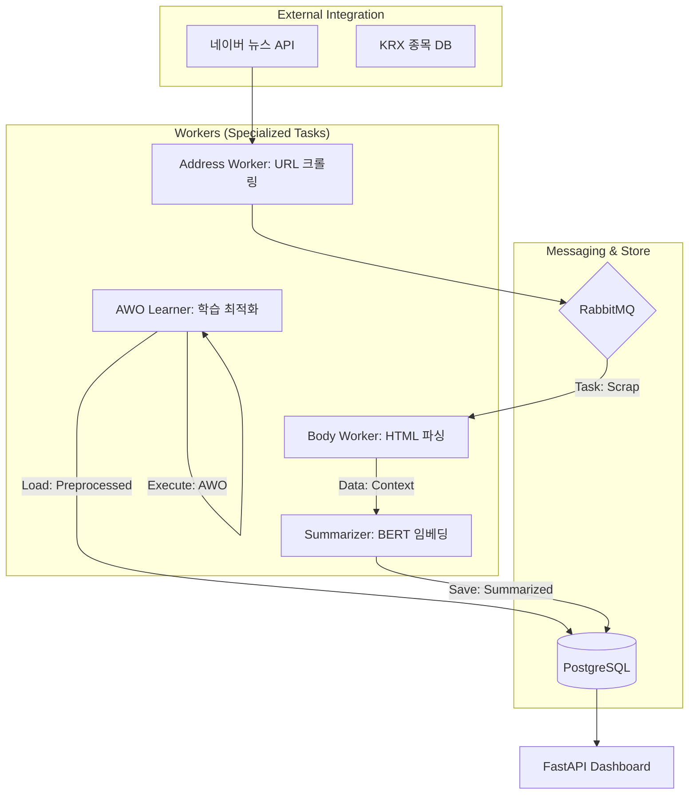
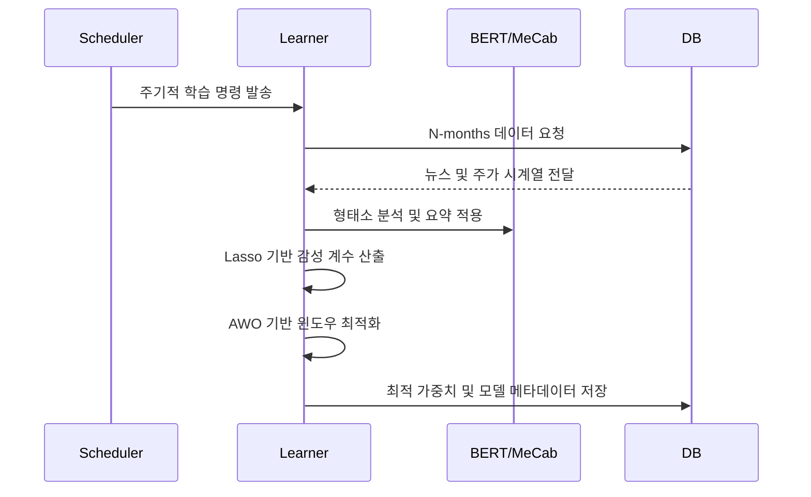

# N-SentiTrader: 실무형 화이트박스 주식 예측 시스템

## 🎓 훈련생을 위한 기술 백서 및 상세 가이드

> **[교육적 목표]** 본 프로젝트는 AI 서비스 개발자 양성과정의 훈련생들이 단순한 모델 사용자를 넘어, **금융 도메인의 특수성**을 이해하고 **설명 가능한 AI(XAI)** 아키텍처를 설계할 수 있도록 돕기 위해 제작되었습니다. "요약"보다는 "원리"에, "결과"보다는 "근거"에 집중하여 <b>생략 없는 구체적 설명</b>을 제공합니다.

---

## 📋 목차
1. [🏛️ 왜 화이트박스(White-Box)인가? (XAI의 가치)](#1-왜-화이트박스white-box인가-xai의-가치)
2. [🛠️ 고도화된 전처리 파이프라인과 필터링 전략](#2-고도화된-전처리-파이프라인과-필터링-전략)
3. [🧠 NLP 전략: N-gram, 사용자 사전, 블랙스완 관리](#3-nlp-전략-n-gram-사용자-사전-블랙스완-관리)
4. [📈 핵심 알고리즘: Lasso 회귀, Time Decay, Lag 시계열](#4-핵심-알고리즘-lasso-회귀-time-decay-lag-시계열)
5. [🧬 AWO 엔진: 비정상성과 체제 전환(Regime Shift) 대응](#5-awo-엔진-비정상성과-체제-전환regime-shift-대응)
6. [🏗️ 시스템 아키텍처 및 마이크로서비스(MSA) 설계](#6-시스템-아키텍처-및-마이크로서비스msa-설계)
7. [📊 데이터 생명주기 및 워크플로우 상세](#7-데이터-생명주기-및-워크플로우-상세)
8. [🚀 시작하기 및 파일 구조 안내](#8-시작하기-및-파일-구조-안내)

---

## 1. 🏛️ 왜 화이트박스(White-Box)인가? (XAI의 가치)

### 🧐 배경: 금융권의 '설명 책임' (Accountability)
금융 시장에서 모델의 판단은 곧 <b>막대한 자산의 변동</b>을 의미합니다. 최근 LLM(GPT-4 등)이 등장했음에도 불구하고, 실무에서 선형 모델 기반의 화이트박스를 선호하는 이유는 명확합니다.

- **규제 준수 (Regulatory Compliance)**: 유럽의 GDPR이나 미국의 ECOA는 신용 평가 및 투자 결정에 대해 <b>"설명할 권리(Right to Explanation)"</b>를 보장합니다. 블랙박스 모델은 "왜 거절되었는가?"에 소송급 답변을 줄 수 없지만, 화이트박스는 가중치로 답변합니다.
- **수리적 근거**: "최근 반도체 관련 긍정 단어 점수가 2.3점 상승하여 매수 신호가 발생함"과 같은 <b>수치적 근거</b>는 프런트 데스크(Traders)와 백 오피스(Compliance) 사이의 소통 기반이 됩니다.

### ✅ 화이트박스 모델의 교육적 가치
훈련생들은 이 모델을 통해 **변수 선택(Feature Selection)**의 과정을 직접 제어할 수 있습니다. 어떤 뉴스가 왜 탈락했는지, 어떤 단어가 수익률에 얼마나 기여했는지(Lasso Coefficient)를 실시간으로 확인하며 알고리즘의 본질을 학습합니다.

---

## 2. 🛠️ 고도화된 전처리 파이프라인과 필터링 전략

단순한 `read_csv`로는 금융 데이터를 다룰 수 없습니다. 뉴스 데이터는 고도로 오염된(Noisy) 데이터셋이기 때문입니다.

### 🧠 필터링 단계 및 도입 이유

| 필터링 단계 | 수행 내용 | 도입 이유 (Why?) |
|------|------|------|
| **① BERT 요약** | KR-FinBERT를 활용한 상위 3개 핵심 문장 추출 | 기사 내 광고, 기자 정보 등 <b>노이즈 제거</b>를 통한 학습 데이터 순도 향상 |
| **② Relevance Scoring** | 종목명 출현 빈도 및 위치 기반 가중치 점수 산출 | <b>가짜 상관관계(Spurious Correlation)</b> 방지. 단순히 언급만 된 기사는 노이즈임 |
| **③ 신뢰도 검증** | 특정 임계값(0.5점) 이상의 기사만 학습 타겟팅 | 모델이 <b>확률적 확신</b>을 가질 수 있는 데이터만 선별하여 과적합 방지 |

#### 🔍 종목 연관성(Relevance) 검증 상세
단순 키워드 매칭이 아닌, 다음의 공식으로 연관성을 평가합니다:
`Score = (HeadInclude * 0.4) + (FirstSentenceInclude * 0.3) + (RelativeFrequency * 0.3)`
- **HeadInclude**: 제목에 종목명이 포함되면 뉴스 가치가 가장 높음.
- **Position Bias**: 첫 문장에 등장할수록 해당 기사의 주된 주제(Target Stock)일 확률이 높음.

---

## 3. 🧠 NLP 전략: N-gram, 사용자 사전, 블랙스완 관리

### 🧬 왜 N-gram(1, 3)과 교착어 문제인가?
한국어 형태소 분석에서 단어 하나(Unigram)는 의미를 심하게 왜곡할 수 있습니다.
- **맥락 보존**: `하락`은 부정적이나, `하락 둔화`는 긍정적입니다. `둔화` 또는 `기대`라는 단어가 결합된 <b>Trigram</b>을 관리함으로써 문맥의 반전(Sentiment Inversion)을 포착합니다.

### 📚 사용자 사전 및 블랙스완(Black Swan) 관리
- **Synonym Mapping (이사전)**: `삼성`, `삼전`, `SAMSUNG`을 모두 `삼성전자(005930)`로 매핑하여 데이터 <b>희소성(Sparsity)</b>을 해소합니다.
- **블랙스완 단어 대응**: `팬데믹`, `전쟁`, `부도`와 같은 단어들은 통계적 빈도는 낮지만 영향력은 파괴적입니다. 이를 일반 학습에만 맡기지 않고, **전문 용어 관리 리스트**에 추가하여 가중치를 민감하게 관리하거나 강제 피처링(Forced Featuring) 합니다.
- **기술 용어**: `HBM3E`, `ASML`, `양자컴퓨팅` 등 형태소 분석기가 쪼개버리기 쉬운 신기술 명칭을 보호하여 정확한 감성 점수를 산출합니다.

---

## 4. 📈 핵심 알고리즘: Lasso 회귀, Time Decay, Lag 시계열

### 📉 Lasso(L1) 정규화: "명확한 특징 추출"
수만 개의 뉴스 단어 중 실제 주가 변동과 상관있는 단어는 극소수입니다.
- **Optimizer Objective**:

$$ \min_{\beta} \left( \|y - X\beta\|^2_2 + \alpha \|\beta\|_1 \right) $$

- **작동 원리**: <b>&alpha;</b> 값이 커질수록 영향력이 적은 가중치를 <b>정확히 0</b>으로 수렴시킵니다. 
이는 불필요한 단어를 모델 스스로 삭제하는 **자동 변수 선택(Feature Selection)** 기능을 수행하여, 결과물인 감성사전을 매우 명확하게 만듭니다.

### ⏳ Time Decay & Lag Effect: "정보의 시효성과 지연 반영"
뉴스는 발행 즉시 가격에 반영되지만, 시장이 정보를 완전히 소화하는 데는 시간이 걸립니다.
- **Exponential Decay**: 뉴스의 영향력은 시간이 지날수록 지수적으로 감소합니다. `Weight = exp(-decay_rate * lag_days)`
- **시계열 지연(Lag-n)**: 오늘의 주가는 어제(D-1) 뿐만 아니라 3일 전(D-3)의 충격에도 반응할 수 있습니다. <b>실증적 연구</b>에 따르면 실적 발표나 대규모 공시는 약 2~5일간의 지연 반영(Lag Effect)을 가집니다. N-SentiTrader는 과거 N일치 뉴스를 적층 연산하여 이 지연 효과를 모델링합니다.

---

## 5. 🧬 AWO 엔진: 비정상성과 체제 전환(Regime Shift) 대응

### 🔄 금융 시장의 비정상성 (Non-stationarity)
시장 환경(금리, 지정학적 위치)이 변하면 과거의 성공 공식이 무너지는 **체제 전환(Regime Shift)**이 발생합니다.

### 🎯 Adaptive Window Optimization (AWO) 전략
- **왜 윈도우 크기를 여러 개 비교하는가?**: 
    - **Short Window (3개월)**: 최근의 트렌드에 민감하게 반응(High Variance), 노이즈에 취약.
    - **Long Window (12개월)**: 장기적인 관성 파악(Low Variance), 시장 변화 대응에 둔감.
- **AWO의 핵심**: 단순히 성능이 좋은 윈도우를 찾는 것이 아니라, 파라미터 변화에도 성능이 안정적으로 유지되는 <b>안정성 점수(Stability Score)</b>를 산출합니다. 이를 통해 **Walk-Forward Validation** 과정에서 모델이 최적의 '학습 시계'를 스스로 결정하도록 합니다.

---

## 6. 시스템 아키텍처 및 마이크로서비스(MSA) 설계

시스템은 17개의 Docker 컨테이너로 독립되어 있으며, 각각 전용 하드웨어 자원을 효율적으로 사용합니다.



---

## 7. 📊 데이터 생명주기 및 워크플로우 상세

### 🔄 일주일의 데이터 여정
1. **평일 (09:00~15:30)**: 실시간 뉴스 수집 및 가중치 기반 **예측 신호 생성**.
2. **평일 (20:00)**: 당일 종가 데이터를 바탕으로 오늘의 감성 분석 결과와 주가 변동의 **정답(Label) 생성**.
3. **매주 토요일 (03:00)**: 스케줄러가 가동되어 **AWO 재학습** 시작.
    - 지난 N개월 데이터의 윈도우 파라미터 재검증.
    - 새로운 시장 체제(Regime)에 맞춘 **감성사전 가중치 업데이트**.

### 📈 학습 프로세스 상세 (Sequence)


---

## 8. 🚀 시작하기 및 파일 구조 안내

### ⚙️ 빠른 실행 가이드
```bash
# 1. 환경 설정
cp .env.sample .env

# 2. 시스템 빌드 및 실행
docker-compose up -d --build

# 3. 필수 상식: 종목 정보 동기화
# 이 단계를 거행해야 사용자 사전과 종목 리스트가 DB에 반영됩니다.
docker exec -it n_senti_dashboard python -m src.scripts.sync_stock_master
```

### 📂 주요 디렉토리 가이드
- `src/nlp/tokenizer.py`: **N-gram** 생성 및 **사용자 사전** 매핑의 중심.
- `src/learner/lasso.py`: **L1 정규화**를 이용한 가중치 학습 엔진.
- `src/learner/awo_engine.py`: **체제 전환**을 감지하기 위한 윈도우 최적화 로직.
- `src/predictor/scoring.py`: **Time Decay**가 적용된 실시간 점수 산출 로직.

---

### 👨‍💻 기여 및 학습 문의
본 프로젝트는 **데이터로 증명하는 금융 AI 개발자**를 꿈꾸는 여러분을 위해 설계되었습니다. 

*Designed for clarity, built for transparency.*
