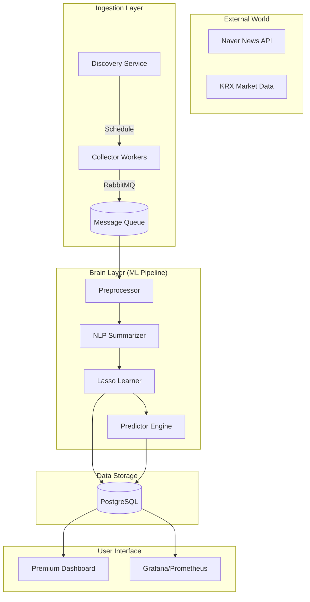

# N-SentiTrader: Ultimate Technical Whitepaper (v2.0)

[](https://www.python.org/)
[](https://opensource.org/licenses/MIT)
[](https://github.com/dev/N-SentiTrader)
[](https://github.com/dev/N-SentiTrader)

N-SentiTrader는 한국 주식 시장의 뉴스를 수집하고, **설명 가능한 AI(XAI)** 기술을 활용하여 감성 기반의 수익률을 예측하며, 이를 교육적으로 시각화하는 지능형 트레이딩 지원 시스템입니다. 이 문서는 31단계의 개발 공정을 거쳐 완성된 프로젝트의 모든 기술적 세부 사항과 과학적 근거를 담고 있습니다.

---

## 1. 🎯 프로젝트 비전 및 설계 철학 (Project Vision & Philosophy)

본 프로젝트는 단순한 수익률 예측 도구를 넘어, **"왜 그런 결과가 나왔는가?"**에 답할 수 있는 투명한 AI 시스템을 지향합니다.

### 🧠 설명 가능한 AI (XAI: Explainability First)
현대 금융 업계는 **GDPR**, **EU AI Act**, 그리고 국내의 **개인정보보호법/신용정보법**에 따라 알고리즘의 예측 근거를 제시할 의무가 강화되고 있습니다. 
- **White-box Model**: 딥러닝 Black-box 대신, 변수 가중치가 명확한 **Lasso(L1 정규화)** 회귀 모델을 주 엔진으로 채택했습니다.
- **Trust & Compliance**: 금융 보안 및 심사 분야의 트렌드에 따라, 단순히 예측력이 높은 모델보다 해석 가능한 모델을 제공하여 개발자 교육 및 실무 적용성을 극대화했습니다.

> [!TIP]
> **초보 개발자를 위한 팁**: 딥러닝 모델은 결과는 좋지만 '왜' 그런지 설명하기 어렵습니다(Black-box). 반면 Lasso와 같은 선형 모델은 가중치를 직접 확인할 수 있어, 어떤 단어가 매수/매도 결정을 내렸는지 고객에게 설명해야 하는 금융 서비스에 매우 유리합니다.

### 💎 프리미엄 교육 자산 (Educational Excellence)
- **Visual Learning**: 모든 데이터 흐름을 **Glassmorphism** 기반의 대시보드와 Grafana를 통해 시각화하여, 데이터가 어떻게 신호로 변하는지 직관적으로 학습할 수 있도록 설계했습니다.
- **Architectural Reference**: 입문 개발자가 **MSA(Microservices Architecture)**, **메시지 큐(RabbitMQ)**, **분산 워커** 구조를 실제로 경험해 볼 수 있는 모범 사례를 제공합니다.

---

## 2. 🏗️ 시스템 아키텍처 및 로드맵 (Architecture & Roadmap)

### 🚀 MSA 기반의 마이크로서비스 설계
시스템은 독립적으로 실행 가능한 5가지 핵심 서비스 레이어로 나뉩니다.



### 🛣️ 31단계 개발 히스토리 (The 31-Phase Evolution)
본 프로젝트는 **31개의 Phase**를 통해 점진적으로 진화해 왔습니다.

| Phase | 상세 마일스톤 (Detailed Milestones) | 핵심 기술 구현 (Key Implementation) |
|:---:|:---|:---|
| **P1-3** | 기초 환경 및 시간 데이터 로직 | `datetime_helper` 생성, KST 변환, 데이터 정합성 기초 확립 |
| **P4-5** | 파이프라인 기초 및 필터링 | **Time Decay** 초기 모델 도입, `collector` -> `preprocessor` 연결 |
| **P6-8** | 스마트 오케스트레이션 | **MasterOrchestrator** 도입, 스케줄러 자동화, 작업 간 의존성 관리 |
| **P9-10** | Lasso 최적화 및 Ordered Lasso | **Ordered Lasso** (시간 가중 정규화) 도입, `celer` 활용 가속 시작 |
| **P11-13** | 인프라 자동화 및 하트비트 | **RabbitMQ** 하트비트 프로세스 분리, 좀비 워커(Zombie Worker) 탐지 로직 |
| **P14-16** | 데이터 정교화 및 중복 제거 | 뉴스 URL 교차 참조(`url_hash`) 중복 제거, 005930-000660 매핑 개선 |
| **P17-20** | 인프라 확장 및 큐 관리 | `verification_daily` vs `verification_jobs` 큐 분리, 워커 스케일링 |
| **P21-24** | 시각화 고도화 (Grafana) | 16개 컴포넌트 실시간 Flow 시각화, **Glassmorphism** 대시보드 완성 |
| **P25-27** | 운영 지능화 (AI Monitoring) | **Gap Detection**(공백 탐지), **One-Click Backfill**, KST 시각 보정 |
| **P28-29** | 성능 극한 최적화 | **MLX** GPU 가속, **Generator** 기반 메모리 최적화, `min_df=3` 노이즈 필터링 |
| **P30-31** | 시스템 안정화 및 정리 | `datetime.now(timezone.utc)` 최신 API 반영, 레거시 파일(143MB) 아카이빙 |

> [!IMPORTANT]
> **31단계의 교훈**: 복잡한 시스템은 한 번에 만들어지지 않습니다. 본 로드맵은 MVP(최소 기능 제품)에서 시작해, 실제 운영상의 문제(메모리 부족, 좀비 워커 등)를 하나씩 해결해 나가는 **애자일 개발의 정수**를 보여줍니다.

---

## 3. 🛡️ 데이터 수집 및 인텔리전스 (Data Intelligence)

### 📡 지능형 수집 시스템 (Smart Collection)
- **Gap Detection**: 뉴스 수집 데이터가 0인 날짜를 자동으로 탐지하여 운영 공백을 방지합니다.
- **One-Click Backfill**: 탐지된 공백은 사용자의 클릭 한 번으로 특정 기간만 정밀하게 수집하는 로직을 갖추고 있습니다.
- **Deduplication & Cross-Referencing**: 동일한 뉴스 URL이 여러 종목에 걸쳐 나타날 때, 중복 로그를 방지하면서도 각 종목별 매핑(`tb_news_mapping`)을 정확히 수행합니다.

### 🧠 뉴스 필터링 및 요약 (Intelligence Layer)
금융 노이즈를 제거하기 위해 단순 수집 이상의 지능형 레이어를 적용했습니다.

1.  **Relevance Scorer (휴리스틱 채점)**:
    - **Target Focus**: 제목에 종목명 포함 시 +50점, 첫 문단 포함 시 +20점 부여.
    - **Competitor Penalty**: 경쟁사 언급이 목표 종목보다 1.5배 이상 많을 경우 점수를 차감하여 '스쳐 지나가는 뉴스'를 필터링합니다.
    - **Logic**: LLM보다 100배 빠른 O(N) 복잡도의 알고리즘으로 실시간 처리를 실현했습니다.

2.  **KR-FinBERT 기반 추출 요약 (Extractive Summarization)**:
    - **Problem**: 수집된 뉴스 기사의 약 **30~50%**는 광고, 기자 정보 등 학습에 방해가 되는 노이즈입니다.
    - **Method**: `KR-FinBERT` 임베딩을 통해 문서의 중심 문맥과 가장 유사한 **상위 3개 문장**만 추출합니다.
    - **Why Extractive?**: 생성 요약(Abstractive)과 달리 원문의 데이터를 100% 보존(Fidelity)하여 금융 데이터의 신뢰성을 지킵니다.

---

## 4. 🔬 과학적 학습 엔진 (The Sentiment Engine)

N-SentiTrader의 심장은 고도의 통계학적 기법이 집약된 **감성 분석 엔진**입니다.

### 🧮 핵심 알고리즘: Lasso (L1 Regularization)
Lasso 회귀를 통해 수만 개의 단어 중 주가에 유의미한 영향을 미치는 **핵심 감성 단어**만 자동으로 선별합니다.

$$ minimize: ||y - X\beta||^2 + \alpha||\beta||_1 $$

- **Sparsity**: 불필요한 단어의 가중치를 0으로 만들어, 모델의 해석 가능성을 극한으로 높입니다.
- **Celer & MLX Solver**: Apple Silicon GPU 가속(MLX)과 Working Set 방식의 Celer 솔버를 사용하여, 10만 건 이상의 데이터를 단 몇 분 만에 학습합니다. (Scikit-Learn 대비 100배 속도 향상)

### 🧪 고급 과학 기법 (Advanced Nuances)
1.  **Ordered Lasso (Temporal Penalty)**: 
    시간 지연(Lag)이 큰 뉴스일수록 정규화 페널티를 강화하여, 먼 과거의 구닥다리 뉴스가 현재 모델에 과적합(Overfitting)되는 것을 방지합니다.
2.  **Dynamic Time Decay (시간 감쇠)**:
    주가 영향력은 시간의 흐름에 따라 지수적으로 감소한다는 **Hong & Stein (1999)**의 연구를 바탕으로 설계되었습니다.
    $$ weight = exp(-decay\_rate \times lag\_days) $$
3.  **Stability Selection (Bootstrap)**:
    데이터의 70%를 무작위 샘플링하여 5회 이상 반복 학습하고, 공통적으로 살아남은 단어만 최종 사전에 등재하여 '우연한 상관관계'를 제거합니다.
4.  **Black Swan Rescue (Hybrid Lexicon)**:
    희귀하지만 치명적인 단어(배임, 횡령, 하한가 등)는 낮은 빈도수에도 불구하고 모델에서 삭제되지 않도록 **Hybrid Lexicon Anchor** 시스템으로 보호합니다.

---

## 5. 📊 AWO: 적응형 윈도우 최적화 (Adaptive Window Optimization)

시장 상황은 시시각각 변합니다(Non-stationarity). N-SentiTrader는 **Pardo (2008)**의 **Walk-Forward Validation** 원칙에 따라 최적의 파라미터를 실시간으로 찾아냅니다.

### 📐 안정성 점수 (Stability Score) 알고리즘
단순히 최고의 Hit Rate를 낸 파라미터가 아닌, 가장 <b>견고(Robust)</b>한 설정을 찾기 위해 복합 점수를 산출합니다.

$$ Stability Score = (0.6 \times Mean(HR)) + (0.4 \times (1 - Norm.MAE)) - (1.0 \times StdDev(HR)) $$

- **Robust Plateau**: 특정 시점에만 잘 맞는 파라미터(Spurious Peak)를 걸러내고, 주변 설정값들과 함께 안정적인 성능을 보이는 구간을 선정합니다.
- **Evaluation Metrics**: Hit Rate(방향성), MAE(오차), IC(정보계수)를 종합하여 최상의 **Golden Parameters**를 도출합니다.

---

## 6. ⚙️ 인프라 및 운영 (Infra & Operations)

### 🏗️ 분산 워커 시스템 (Distributed Workers)
메시지 큐(RabbitMQ)를 통해 작업 부하를 효율적으로 분산합니다.
- **Body Worker (4x)**: 뉴스 본문 수집 및 BERT 요약 담당 (가장 무거운 작업).
- **Verification Light (2x)**: 일일 소규모 업데이트 및 예측 담당.
- **Verification Heavy (1x)**: 12개월 이상의 방대한 AWO 스캔 담당.

### 📈 Grafana 통합 모니터링
- **4x4 Grid Board**: 뉴스 수집량, 워커 상태, 모델 성능 등 16개 핵심 지표를 실시간 모니터링합니다.
- **Heartbeat System**: 각 워커의 활성 상태를 30초 주기로 체크하여 좀비 워커 발생 시 개발자에게 즉시 경보를 보냅니다.

---

## 🚦 시작하기 (Getting Started)

### 환경 설정 (.env)
```bash
# Naver API Keys
NAVER_CLIENT_ID=your_id
NAVER_CLIENT_SECRET=your_secret

# Database
POSTGRES_USER=postgres
POSTGRES_PASSWORD=your_password
POSTGRES_DB=sentitrader
```

### 실행 (Docker Compose)
```bash
# 전체 서비스 빌드 및 실행
docker-compose up --build -d
```

---

## 📚 기술적 근거 및 참고 문헌 (Technical Rationale)

- **Lasso Regression**: Robert Tibshirani (1996), *Regression Shrinkage and Selection via the Lasso*.
- **Lag Effects**: Hong & Stein (1999), *A Unified Theory of Underreaction, Momentum Trading, and Overreaction in Asset Markets*.
- **Walk-Forward Validation**: Robert Pardo (2008), *The Evaluation and Optimization of Trading Strategies*.
- **Korean NLP**: MeCab (Morphemic Analysis) & KR-FinBERT (Financial Domain Embedding).
- **Compliance**: EU AI Act (Horizontal Traceability & Explainability).

---

## 📂 디렉토리 구조 (Directory Structure)

```text
N-SentiTrader/
├── src/
│   ├── collector/      # 뉴스 및 시세 수집기 (RabbitMQ 기반)
│   ├── learner/        # 핵심 모델링 (Lasso, Celer, MLX, AWO)
│   ├── nlp/            # 형태소 분석기 및 BERT 요약기
│   ├── dashboard/      # FastAPI 기반 대시보드 API
│   └── predictor/      # 실시간 신호 생성 엔진
├── docs/               # 31단계 개발 로그 및 기술 문서
├── grafana/            # 모니터링 대시보드 설정
└── docker-compose.yml  # MSA 인프라 구축 매니페스트
```

---

**N-SentiTrader**는 투명한 예측과 견고한 아키텍처를 통해 차세대 AI 금융 개발자들을 위한 최상의 지식 전수 플랫폼이 되고자 합니다.
