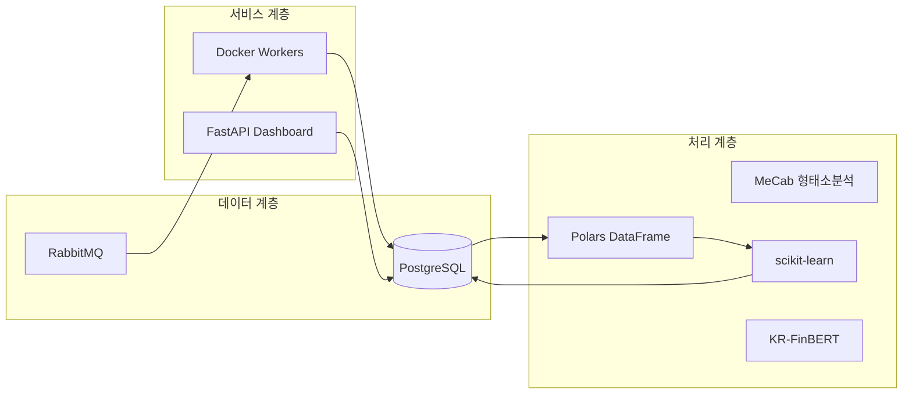
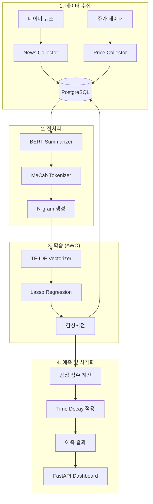
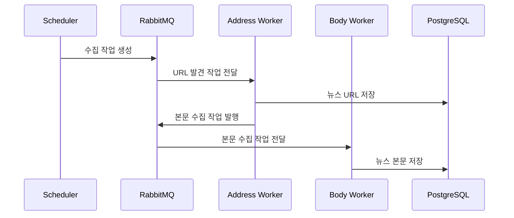

# N-SentiTrader

## 🚀 한국어 뉴스 기반 주식 감성 분석 및 하이브리드 예측 시스템

> **[교육용 프로젝트]** 본 프로젝트는 AI 서비스 개발자 양성과정의 훈련생들을 위해 설계된 <b>'화이트박스(White-Box) 머신러닝'</b> 기반의 실무형 주식 예측 플랫폼입니다.

[](https://github.com/silverwoods-dev/N-SentiTrader)
[](https://python.org)
[](https://fastapi.tiangolo.com)
[](https://www.docker.com)

---

## 📋 목차
1. [프로젝트 철학: 왜 화이트박스인가?](#1-프로젝트-철학-왜-화이트박스인가)
2. [기술 스택 및 시스템 아키텍처](#2-기술-스택-및-시스템-아키텍처)
3. [전처리 파이프라인 (BERT & 필터링)](#3-전처리-파이프라인-bert--필터링)
4. [핵심 알고리즘: Lasso 회귀와 감성 사전](#4-핵심-알고리즘-lasso-회귀와-감성-사전)
5. [AWO (Adaptive Window Optimization) 엔진](#5-awo-adaptive-window-optimization-엔진)
6. [마이크로서비스 설계 및 워크플로우](#6-마이크로서비스-설계-및-워크플로우)
7. [빠른 시작 가이드](#7-빠른-시작-가이드)
8. [디렉토리 구조](#8-디렉토리-구조)
9. [향후 과제 및 한계점](#9-향후-과제-및-한계점)

---

## 1. 프로젝트 철학: 왜 화이트박스인가?

본 프로젝트는 입문자들이 AI의 블랙박스(Black-Box) 안을 들여다보고, <b>"왜 이 모델이 BUY 신호를 보냈는가?"</b> 에 대해 수학적/논리적 근거를 제시할 수 있도록 설계되었습니다.

### 🔍 화이트박스 vs. 블랙박스 비교

| 구분 | 화이트박스 (본 프로젝트) | 블랙박스 (LLM 등) |
|------|-------------------------|-------------------|
| **해석 가능성** | <b>✅ 모든 예측 근거 확인 가능</b> | ❌ 내부 작동 불투명 |
| **학습 효과** | <b>✅ 알고리즘 원리 직접 학습</b> | ❌ API 호출만 학습 |
| **하드웨어 요구** | <b>✅ 일반 PC에서 실행</b> | ❌ GPU/고사양 필요 |
| **비용** | <b>✅ 무료 (오픈소스)</b> | ❌ API 비용 발생 |

### 주요 장점
1. **설명 가능성 (XAI)**: Lasso(L1 규제)를 통해 불필요한 단어를 제거하고, <b>수익률에 직접 기여하는 핵심 키워드(Feature)</b>만 남겨 투명성을 확보합니다.
2. **학습 효율성**: 수억 개의 파라미터 대신 수만 개의 토큰을 다루는 경량 모델로 전체 ML Lifecycle(학급-검증-배포)을 경험합니다.

---

## 2. 기술 스택 및 시스템 아키텍처

### 🛠️ 기술 스택


| 영역 | 기술 | 선택 이유 |
|------|------|----------|
| **언어** | Python 3.12 | 데이터 과학 표준 언어 및 풍부한 라이브러리 생태계 |
| **ML 프레임워크** | scikit-learn | 경량화, 높은 해석 가능성, 교육 목적에 최적화된 인터페이스 |
| **데이터 처리** | Polars | Rust 기반 병렬 처리로 Pandas 대비 메모리 효율 및 속도 압도 |
| **형태소 분석** | MeCab | 한국어 처리 속도 최상, 사용자 정의 사전 및 별칭 매핑 용이 |
| **API 서버** | FastAPI | Pydantic 기반 비동기 처리, Swagger 자동 문서화 및 빠른 성능 |
| **메시지 큐** | RabbitMQ | 안정적인 비동기 작업 분배, 워커 스케일링을 통한 부하 분산 |
| **데이터베이스** | PostgreSQL | 관계형 데이터의 무결성 보장 및 전문(Full-text) 검색 지원 |
| **컨테이너** | Docker + Compose | 개발/운영 환경 일관성 유지 및 마이크로서비스 관리 효율화 |

### 🏗️ 시스템 아키텍처 (전체 흐름)


---

## 3. 전처리 파이프라인 (BERT & 필터링)

데이터의 노이즈를 제거하고 정확도를 높이기 위해 다음과 같은 고도화된 전처리를 수행합니다.

### 🧠 BERT 기반 뉴스 추출 요약 (`NewsSummarizer`)
대부분의 뉴스 기사에는 기자명, 사진 설명, 지난 뉴스 요약 등 불필요한 정보가 <b>30~50%</b>를 차지합니다.
- **작동 원리**: `KR-FinBERT`를 사용하여 문장별 임베딩을 생성한 후, 전체 문서의 중심 벡터와 가장 유사한(Global Importance) <b>상위 3개 문장</b>을 추출합니다.
- **도입 효과**: 텍스트의 핵심(Main Topic)에 집중함으로써 Lasso 모델이 가짜 상관관계(Spurious Correlation)에 빠지는 것을 방지합니다.

### 🎯 종목 관련도 필터링
- 모든 뉴스를 무분별하게 학습하지 않습니다. 뉴스 내 종목명의 출현 빈도와 위치 기반의 <b>Relevance Score</b>를 계산하여, 특정 임계값 이상의 뉴스만 학습 데이터로 포함시킵니다.

---

## 4. 핵심 알고리즘: Lasso 회귀와 감성 사전

### L1 정규화(Lasso)를 선택한 이유
주식 뉴스는 <b>희소성(Sparsity)</b>이 강합니다. 하루에 수천 개의 단어가 언급되지만, 실제 주가에 영향을 미치는 단어는 소수입니다.

- **수식 (Optimizer Objective)**:
  $$ \min_{\beta} \left( \|y - X\beta\|^2_2 + \alpha \|\beta\|_1 \right) $$
- **역할**: $\alpha$ 값이 커질수록 영향력이 적은 단어의 가중치($\beta$)는 <b>정확히 0</b>이 되어 모델에서 탈락됩니다.

### 📈 프로세스 및 단계별 상세 (Training Process)

| 단계 | 설명 | 핵심 라이브러리 / 파라미터 |
|------|------|--------------------------|
| **1. 데이터 로드** | 정해진 윈도우 기간의 뉴스 및 주가 데이터 수집 | `Polars (Data Retrieval)` |
| **2. 토큰화** | MeCab 활용 명사 추출 및 N-gram 조합 생성 | `MeCab`, `ngram_range=(1,3)` |
| **3. 벡터화** | 단어 빈도 기반 TF-IDF 희소 행렬 변환 | `TfidfVectorizer`, `max_features=50000` |
| **4. 회귀 학습** | Lasso 회귀를 통한 수익률 기여도(Beta) 산출 | `Lasso (Coordinate Descent)`, `alpha` |
| **5. 사전 저장** | 유효한 가중치를 가진 단어들을 DB에 영속화 | `PostgreSQL (Senti Dict)` |

### 📈 예측 계산 공식 (Prediction Logic)
1. **토큰화**: MeCab + N-gram (1,3) 생성.
2. **벡터화**: TF-IDF 변환 (`max_features=50000`).
3. **감성 점수 계산**:
   ```python
   # Time Decay 반영 감성 점수 공식
   decay_weight = exp(-alpha * lag_days)
   score = Σ (word_weight × decay_weight × tf-idf_value)
   ```
4. **Hybrid v2 모델**: 뉴스 감성 점수와 <b>기술적 지표(RSI, MACD, 이동평균선)</b>를 결합하여 정성/정량 데이터를 통합 분석합니다.

---

## 5. AWO (Adaptive Window Optimization) 엔진

금융 시장은 <b>비정상성(Non-stationarity)</b>을 띱니다. 과거의 패턴이 현재에도 유효한지 검증하기 위해 AWO 엔진을 사용합니다.

### 🧬 운영 구조
- **2차원 그리드 서치**: `Window (3~12개월)` 와 `Alpha (규제 강도)` 의 최적 조합을 탐색합니다.
- **Walk-Forward Validation**: 데이터를 시간 순으로 자르며 전진 검증하여, 미래 예견 편향(Look-ahead bias)을 원천 차단합니다.
- **안정성 점수(Stability Score)**: 특정 지점의 성능만 보는 것이 아니라, 주변 파라미터 변화에도 성능이 유지되는지(Robustness)를 평가합니다.

---

## 6. 마이크로서비스 설계 및 워크플로우

프로젝트는 <b>안정성</b>과 <b>분산 처리</b>를 위해 17개의 Docker 컨테이너로 구성된 MSA 아키텍처를 가집니다.

### 🔄 데이터 수집 워크플로우


### 🏢 마이크로서비스의 이점
- **자원 격리**: BERT 요약 작업처럼 CPU/GPU 부하가 큰 작업이 크롤링 성능에 영향을 주지 않도록 격리합니다.
- **독립 배포**: 특정 수집 모듈에 장애가 발생해도 전체 시스템은 가동 상태를 유지합니다.
- **확장성**: `RabbitMQ`를 통해 부하가 큰 구간의 워커(Worker) 컨테이너만 증설하여 성능을 개선합니다.

---

## 7. 빠른 시작 가이드

### ⚙️ 설치 및 실행
```bash
# 1. 저장소 클론 및 설정
git clone https://github.com/silverwoods-dev/N-SentiTrader.git
cd N-SentiTrader
cp .env.sample .env

# 2. 실행 (Docker 필요)
docker-compose up -d --build

# 3. 데이터 동기화 (전 종목 마스터)
docker exec -it n_senti_dashboard python -m src.scripts.sync_stock_master
```

### 🔗 주요 서비스 URL
| 서비스 | URL | 설명 |
|--------|-----|------|
| **Dashboard** | http://localhost:8081 | 실시간 예측 및 성과 분석 |
| **Grafana** | http://localhost:3000 | 인프라 및 워커 모니터링 |
| **RabbitMQ** | http://localhost:15672 | 메시지 큐 상태 관리 |
| **API Docs** | http://localhost:8081/docs | Swagger 기반 인터랙티브 문서 |

---

## 8. 디렉토리 구조
```text
N-SentiTrader/
├── src/
│   ├── collector/          # 뉴스 주소 및 정보 수집
│   ├── collectors/         # 주가/재무/공시 데이터 수집기
│   ├── learner/            # ML 학습 (Lasso, AWO, Validator)
│   ├── predictor/          # 실시간 감성 스코어링 및 시그널링
│   ├── dashboard/          # FastAPI 웹 대시보드 및 API
│   ├── nlp/                # 자연어 처리 (Summarizer, Tokenizer)
│   └── utils/              # 하위 시스템 연결 (MQ, DB, Metrics)
├── docker-compose.yml      # 전체 컨테이너 오케스트레이션
├── main_scheduler.py       # 주기적 작업 관리 (Cron)
└── README.md               # 본 문서
```

---

## 9. 향후 과제 및 한계점

- **선형 모델의 한계**: Lasso는 단어 간의 복잡한 문맥(Context) 파악에 한계가 있어, 향후 BERT 임베딩 기반의 딥러닝 모델 비중을 높일 계획입니다.
- **레이턴시(Latency)**: BERT 요약 및 모델 리트레이닝 시간을 단축하기 위한 경량화(Quantization) 및 분산 학습 도입이 필요합니다.
- **데이터 품질**: 자극적인 헤드라인(낚시성 기사)에 의한 과적합(Overfitting) 방지 로직 고도화.

---

### 👨‍💻 기여 및 문의
본 프로젝트는 교육적 목적을 위해 상시 열려 있습니다. 궁금한 점이나 제안 사항은 Issue를 통해 남겨주세요.

*Designed for the Next Generation of AI Developers.*
