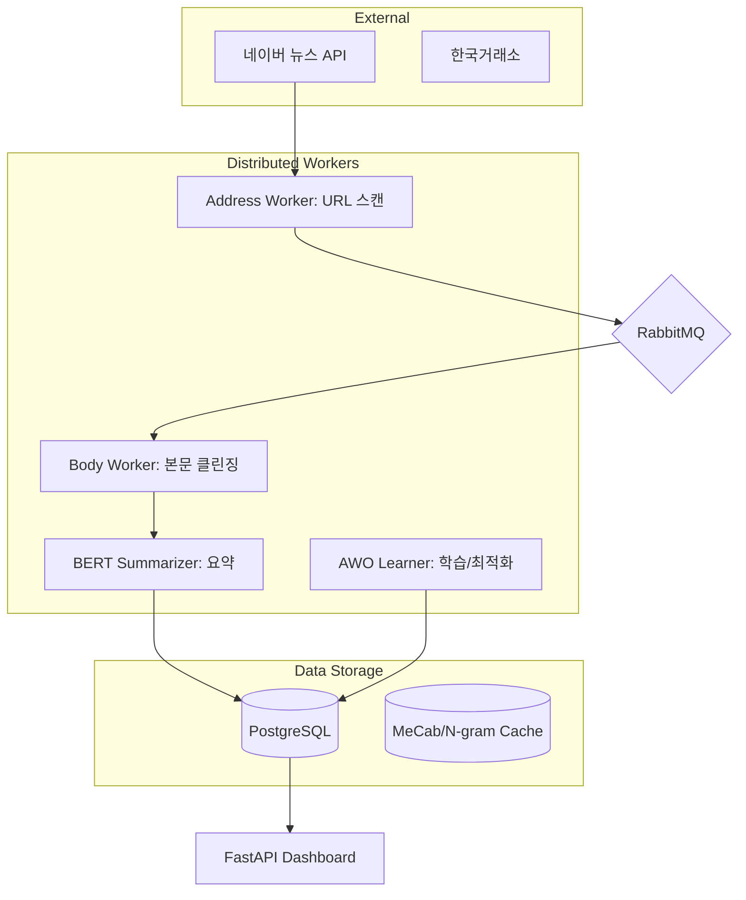
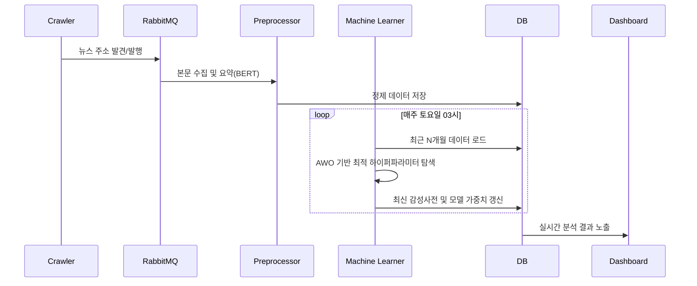

# N-SentiTrader: 실무형 화이트박스 주식 예측 시스템

## 🎓 훈련생을 위한 친절하고 상세한 가이드 (Full Technical Whitepaper)

> **[교육적 목표]** 본 프로젝트는 AI 서비스 개발자 양성과정의 훈련생들이 단순한 모델 사용자를 넘어, **금융 도메인의 특수성**을 이해하고 **설명 가능한 AI(XAI)** 아키텍처를 설계할 수 있도록 돕기 위해 제작되었습니다. "요약"보다는 "원리"에, "결과"보다는 "근거"에 집중합니다.

---

## 📋 목차
1. [🏛️ 왜 화이트박스(White-Box) 모델인가?](#1-왜-화이트박스white-box-모델인가)
2. [🛠️ 데이터 전처리 및 필터링 전략](#2-데이터-전처리-및-필터링-전략)
3. [🧠 NLP 전략: N-gram과 사용자 사전](#3-nlp-전략-n-gram과-사용자-사전)
4. [📈 핵심 알고리즘: Lasso 회귀와 Time Decay](#4-핵심-알고리즘-lasso-회귀와-time-decay)
5. [🧬 AWO 엔진: 시장의 비정상성 대응](#5-awo-엔진-시장의-비정상성-대응)
6. [🏗️ MSA 기반 시스템 아키텍처](#6-msa-기반-시스템-아키텍처)
7. [📊 데이터 및 워크플로우 상세](#7-데이터-및-워크플로우-상세)
8. [🚀 시작하기 및 구조 안내](#8-시작하기-및-구조-안내)

---

## 1. 🏛️ 왜 화이트박스(White-Box) 모델인가?

### 🧐 배경: 금융권의 '설명 책임' (Accountability)
최근 LLM(GPT-4, Claude 등)이 높은 성능을 보이지만, 금융권(Banking/Fintech)에서 도입할 때는 **"왜 이 종목을 추천했는가?"**에 대한 명확한 답변이 필요합니다. 
- **규제 대응**: GDPR(유럽), ECOA(미국) 등은 자동화된 의심 판정에 대한 '설명 권리'를 명시합니다. 
- **신뢰성**: 수천억 원의 자금을 운용하는 기관에서 "모델이 그냥 추천했다"는 식의 대답은 리스크 관리가 불가능함을 의미합니다.

### ✅ 화이트박스 모델의 교육적/실무적 가치
| 가치 | 설명 |
|------|------|
| **투명성** | <b>Lasso(L1)</b> 회귀를 사용하면 0이 아닌 가중치를 가진 단어들만 모아 '감성사전'을 직접 눈으로 확인할 수 있습니다. |
| **추론 속도** | 딥러닝 대비 CPU 환경에서도 빠른 실시간 추론이 가능합니다. |
| **디버깅 용이성** | 특정 예측이 틀렸을 때, 어떤 단어(Feature)가 잘못된 가중치를 가졌는지 즉시 파악하고 수정(사용자 사전 등)할 수 있습니다. |

---

## 2. 🛠️ 데이터 전처리 및 필터링 전략

### 🎯 왜 다중 필터링을 사용하는가?
인터넷 뉴스는 '노이즈'가 매우 많습니다. (예: 광고, 낚시성 기사, 종목과 상관없는 시황). 이를 거르지 않으면 모델은 **가짜 상관관계(Spurious Correlation)**에 빠져 성능이 급격히 저하됩니다.

#### ① BERT 기반 추출 요약 (`Summarization`)
- **이유**: 기사의 30~50%는 기자 정보나 관련 없는 이전 기사 요약입니다. 
- **방법**: `KR-FinBERT` 임베딩을 통해 문서의 문맥적 핵심 벡터를 생성하고, 이와 가장 유사한 **상위 3개 문장**만 남깁니다.

#### ② 종목 관련도 검증 (`Relevance Scoring`)
- **검증 방법**: 뉴스 본문 내 종목명의 **출현 빈도**, **첫 등장 위치**, **헤드라인 포함 여부**에 가중치를 부여합니다.
- **예**: "삼성전자"가 제목에 있고 첫 문장에 등장하면 0.9점, 본문 끝에 스치듯 언급되면 0.1점을 부여하여 0.5점 이상만 학습에 사용합니다.

---

## 3. 🧠 NLP 전략: N-gram과 사용자 사전

### 🧬 왜 N-gram(1, 3)을 도입하는가?
한국어는 **교착어**로서 조사가 붙으며, 앞뒤 단어의 조합에 따라 의미가 완전히 반전됩니다.
- **예**: `하락` (부정) vs `하락 둔화` (긍정).
- **해결**: 단어 하나(Unigram)만 보면 '하락'을 나쁜 것으로만 보지만, **Trigram (하락 + 둔화 + 기대)**으로 묶어 보면 긍정 신호를 포착할 수 있습니다.

### 📚 사용자 사전(Custom Dictionary) 관리의 필수성
- **전문 용어**: 'HBM', '초거대 AI', '금리 인상' 등은 일반 형태소 분석기에서 쪼개지면 의미를 잃습니다.
- **제품명/종목명**: '현대차'가 '현대'와 '차'로 분리되지 않도록 관리해야 합니다.
- **블랙스완 단어**: 과거 '팬데믹', '리먼 브라더스' 같은 희귀하지만 파괴적인 단어들을 고정 가중치로 관리하거나 예외 처리하기 위해 사용자 정의가 필요합니다.

---

## 4. 📈 핵심 알고리즘: Lasso 회귀와 Time Decay

### 📉 Lasso(L1) 회귀: "금융 데이터의 희소성(Sparsity) 해결"
주식 시장에 영향을 미치는 단어는 수만 개 중 수백 개에 불과합니다.
- **수식**:
  $$ \min_{\beta} \left( \|y - X\beta\|^2_2 + \alpha \|\beta\|_1 \right) $$
- **핵심**: $\alpha$ (규제 강도)를 높이면 성능에 기여도가 낮은 단어들의 가중치를 **완전히 0**으로 만듭니다. 이를 통해 모델은 가장 파괴력 있는 단어들만 남긴 **'정제된 감성사전'**을 구성합니다.

### ⏳ Time Decay: "기사의 유통기한 관리"
오늘의 뉴스가 3일 전 뉴스보다 주가에 더 큰 영향을 미칩니다.
- **이유**: 정보는 시간이 지남에 따라 가격에 반영(Price-in)되어 영향력이 줄어듭니다.
- **함수**: `W = exp(-learning_rate * days_passed)`
- **D-1, D-2... 시계열 분석**: D-day의 주가는 당일 뉴스뿐만 아니라 시장이 소화 중인 어제의 정보에도 반응합니다. 보통 한국 시장은 **D-1에서 D-3** 사이의 뉴스가 가장 높은 상관관계를 보입니다.

---

## 5. 🧬 AWO 엔진: 시장의 비정상성 대응

### 🔄 금융 시장의 비정상성 (Non-stationarity)
작년에 통했던 호재 단어가 올해는 악재가 될 수 있습니다 (예: 금리 인하는 자산 가격 상승 요인이었으나, 경기 침체기엔 침체 신호로 해석됨). 이를 **Regime Shift(체제 전환)**라고 합니다.

### 🎯 Adaptive Window Optimization (AWO)
- **왜 윈도우 크기를 비교하는가?**: 너무 짧으면(3개월) 노이즈에 변동이 심하고, 너무 길면(2년) 과거의 낡은 패턴에 매몰됩니다. 
- **해결**: 3, 6, 9, 12개월 등 다양한 '기억의 길이'를 전진 검증(Walk-Forward)하여 **현재 시장의 호흡**에 가장 잘 맞는 최적의 윈도우를 실시간으로 찾아냅니다.

---

## 6. 🏗️ MSA 기반 시스템 아키텍처



---

## 7. 📊 데이터 및 워크플로우 상세

### 🔄 전체 데이터 플로우 (Data Lifecycle)


---

## 8. 🚀 시작하기 및 구조 안내

### ⚙️ 빠른 실행
```bash
# 환경 설정
cp .env.sample .env
# 실행
docker-compose up -d --build
# 종목 마스터 동기화
docker exec -it n_senti_dashboard python -m src.scripts.sync_stock_master
```

### 📂 핵심 디렉토리 가이드
- `src/nlp/tokenizer.py`: MeCab 기반 사용자 사전 및 N-gram 생성 로직.
- `src/learner/lasso.py`: Lasso 회귀 및 Time Decay 가중치 계산 루틴.
- `src/learner/awo_engine.py`: 윈도우 크기별 성능 비교 및 최적 파라미터 산출.
- `src/scripts/sync_stock_master.py`: KRX 종목 정보 및 사용자 사전 동기화.

---

### 👨‍💻 기여 및 학습 문의
본 프로젝트는 **AI 인재 교육**을 위해 상시 업데이트됩니다. 

*Always stay curious, and always verify with data.*
