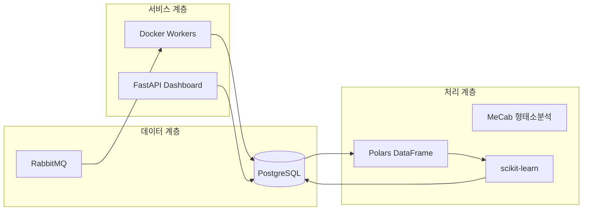
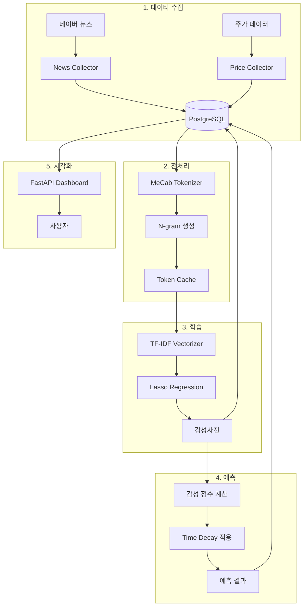
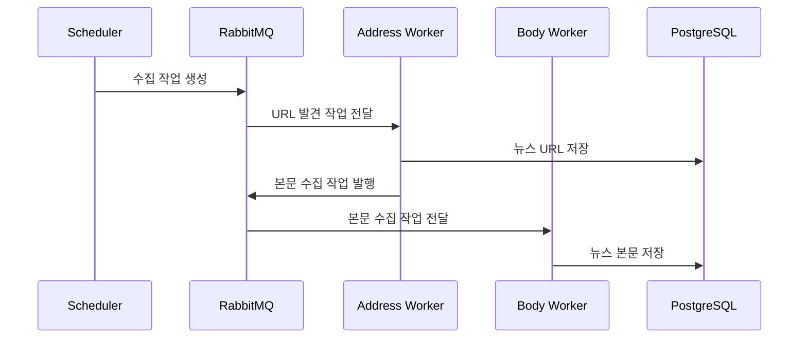

# N-SentiTrader
## 뉴스 기반 주식 감성분석 및 예측 시스템

> **교육용 화이트박스 ML 프로젝트** - 초급 개발자 양성과정 훈련생을 위한 실무 프로젝트

---

## 📋 목차
1. [프로젝트 소개](#프로젝트-소개)
2. [기술 스택](#기술-스택)
3. [시스템 아키텍처](#시스템-아키텍처)
4. [핵심 워크플로우](#핵심-워크플로우)
5. [빠른 시작](#빠른-시작)
6. [디렉토리 구조](#디렉토리-구조)
7. [교육적 설계 철학](#교육적-설계-철학)

---

## 프로젝트 소개

N-SentiTrader는 금융 뉴스의 **텍스트 마이닝**과 **머신러닝**을 활용하여 주식 시장의 감성(시장 심리)을 정량화하고, 개별 종목의 초과 수익(Alpha)을 예측하는 **자동화 시스템**입니다.

### 왜 화이트박스 모델인가?

| 구분 | 화이트박스 (본 프로젝트) | 블랙박스 (LLM 등) |
|------|-------------------------|-------------------|
| **해석 가능성** | ✅ 모든 예측 근거 확인 가능 | ❌ 내부 작동 불투명 |
| **학습 효과** | ✅ 알고리즘 원리 직접 학습 | ❌ API 호출만 학습 |
| **하드웨어 요구** | ✅ 일반 PC에서 실행 | ❌ GPU/고사양 필요 |
| **비용** | ✅ 무료 (오픈소스) | ❌ API 비용 발생 |

### 주요 기능
- 🔍 **뉴스 수집**: 네이버 뉴스 자동 크롤링 (VPN 로테이션 지원)
- 📊 **감성 분석**: Lasso 회귀 기반 감성사전 자동 구축
- 📈 **수익 예측**: Time Decay 적용 초과수익 예측
- 🎯 **자동 최적화**: AWO(Adaptive Window Optimization) 스캔
- 📱 **대시보드**: 실시간 모니터링 및 결과 시각화

---

## 기술 스택



| 영역 | 기술 | 선택 이유 |
|------|------|----------|
| **언어** | Python 3.12 | 데이터 과학 표준 언어 |
| **ML 프레임워크** | scikit-learn | 경량, 해석 가능, 교육에 적합 |
| **데이터 처리** | Polars | pandas 대비 10배 빠른 성능 |
| **형태소 분석** | MeCab | 한국어 처리 최적, 사용자 사전 지원 |
| **API 서버** | FastAPI | 비동기, 자동 문서화, 현대적 |
| **메시지 큐** | RabbitMQ | 분산 작업 처리, 안정성 |
| **데이터베이스** | PostgreSQL | 대용량 텍스트 처리, JSONB 지원 |
| **컨테이너** | Docker + Compose | 환경 일관성, 확장성 |

---

## 시스템 아키텍처



---

## 핵심 워크플로우

### 1️⃣ 데이터 수집 파이프라인



### 2️⃣ 감성사전 학습 프로세스

| 단계 | 설명 | 핵심 파라미터 |
|------|------|--------------|
| 1. 데이터 로드 | N개월 뉴스 + 주가 데이터 | `window_months` |
| 2. 토큰화 | MeCab + N-gram 생성 | `ngram_range=(1,3)` |
| 3. 벡터화 | TF-IDF 변환 (희소 행렬) | `max_features=50000` |
| 4. 회귀 | Lasso 회귀로 가중치 학습 | `alpha` |
| 5. 사전 저장 | 상위 Top-K 단어만 저장 | `top_k=100` |

**Lasso 회귀 수식:**
```
minimize: ||y - Xβ||² + α||β||₁
```
- `y`: 초과수익률 (Target)
- `X`: TF-IDF 행렬 (Features)
- `β`: 단어별 가중치 (감성사전)
- `α`: L1 정규화 강도

### 3️⃣ 예측 계산 공식

```python
# Time Decay 함수
decay_weight = exp(-decay_rate * lag_days)

# 감성 점수 계산
score = Σ (word_weight × decay_weight × tf-idf)

# 예측 신호
if score > threshold:
    signal = "BUY"
elif score < -threshold:
    signal = "SELL"
else:
    signal = "HOLD"
```

---

## 빠른 시작

### 사전 요구사항
- Docker & Docker Compose
- Git

### 설치 및 실행

```bash
# 1. 저장소 클론
git clone https://github.com/your-org/N-SentiTrader.git
cd N-SentiTrader

# 2. 환경 변수 설정
cp .env.sample .env
# .env 파일을 편집하여 필요한 값 입력

# 3. 컨테이너 빌드 및 실행
docker-compose up -d --build

# 4. 대시보드 접속
open http://localhost:8081
```

### 주요 URL
| 서비스 | URL | 설명 |
|--------|-----|------|
| Dashboard | http://localhost:8081 | 메인 대시보드 |
| Grafana | http://localhost:3000 | 인프라 모니터링 |
| RabbitMQ | http://localhost:15672 | 메시지 큐 관리 |

---

## 디렉토리 구조

```
N-SentiTrader/
├── src/
│   ├── collector/          # 뉴스 수집기
│   │   └── news.py         # 메인 크롤러 (35KB)
│   ├── collectors/         # 보조 수집기
│   │   ├── price_collector.py
│   │   └── fundamentals_collector.py
│   ├── learner/            # ML 학습 모듈
│   │   ├── lasso.py        # Lasso 회귀 학습기
│   │   └── awo_engine.py   # AWO 최적화 엔진
│   ├── predictor/          # 예측 모듈
│   │   └── scoring.py      # 감성 점수 계산
│   ├── dashboard/          # FastAPI 웹 서버
│   │   ├── routers/        # API 라우터
│   │   └── templates/      # HTML 템플릿
│   ├── nlp/                # 자연어 처리
│   │   └── tokenizer.py    # MeCab 토크나이저
│   └── utils/              # 유틸리티
│       ├── mq.py           # RabbitMQ 헬퍼
│       └── metrics.py      # Prometheus 메트릭
├── docker-compose.yml      # 컨테이너 오케스트레이션
├── main_scheduler.py       # 작업 스케줄러
└── Dockerfile              # 이미지 빌드 설정
```

---

## 교육적 설계 철학

### 1. 투명성 (White-Box)
모든 예측 결과에 대해 **근거가 되는 뉴스와 키워드**를 확인할 수 있습니다.
```
예측: "삼성전자 상승 예상 (+2.3%)"
근거: 
  - "금리 인하" (+0.8) - 3일 전 뉴스
  - "AI 반도체" (+0.6) - 1일 전 뉴스
  - "수출 호조" (+0.4) - 오늘 뉴스
```

### 2. 경량화
12GB RAM 환경에서 안정적으로 동작하도록 설계:
- Generator 기반 스트리밍 처리
- `min_df=3`으로 희귀 토큰 제거
- 순차적 윈도우 데이터 로딩

### 3. 모듈화
각 컴포넌트가 독립적으로 테스트 가능:
```python
# 개별 컴포넌트 테스트 예시
from src.learner.lasso import LassoLearner

learner = LassoLearner(stock_code="005930")
learner.fetch_data(window_months=3)
learner.train()
```

---

## 📚 추가 문서

- [워크플로우 가이드](./docs/workflows.md) - 상세 작업 흐름 설명
- [API 문서](http://localhost:8081/docs) - 자동 생성 API 문서 (Swagger)
- [개발 히스토리](./docs/development_history.md) - 31개 Phase 개발 내역

---

## 📝 라이선스

Educational Use Only - 교육 목적으로만 사용 가능

---

*이 프로젝트는 빅데이터 분석을 위한 AI 서비스 개발자 양성과정 훈련생을 위해 제작되었습니다.*
