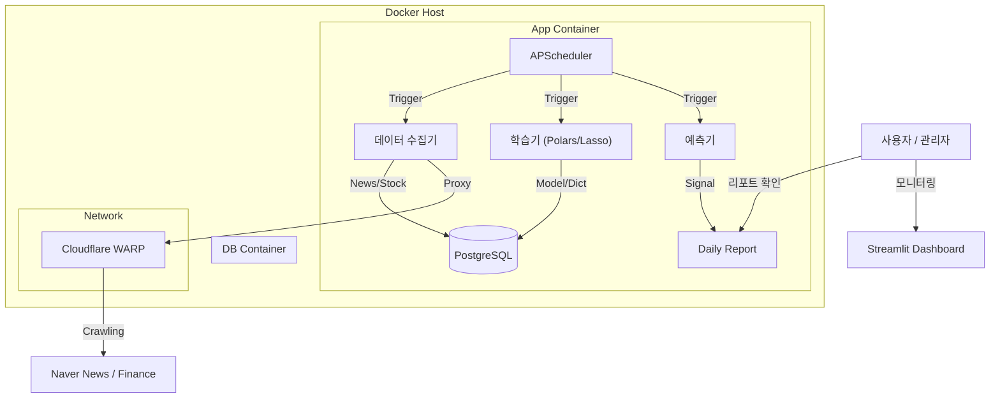
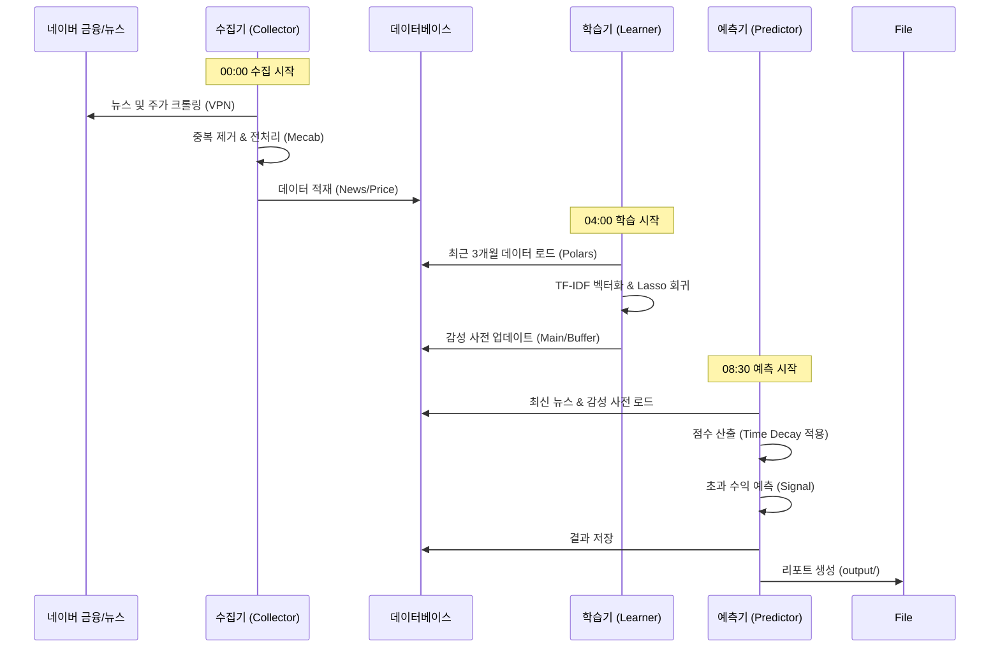
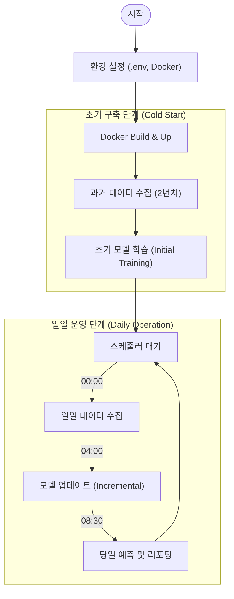

# N-SentiTrader (N-gram Sentiment Trading System)

**N-SentiTrader**는 금융 뉴스의 텍스트 마이닝을 통해 시장의 감성을 분석하고, 이를 바탕으로 개별 종목의 초과 수익(Excess Return)을 예측하는 자동화 시스템입니다.
단순 단어(Unigram) 분석을 넘어, **N-gram(Bigram, Trigram)** 분석을 통해 "금리 인상", "실적 호조"와 같은 구문 단위의 맥락을 파악하여 정교한 감성 사전을 구축합니다.

---

## 🚀 주요 기능 (Key Features)

### 1. 정교한 텍스트 분석 (Advanced NLP)
*   **N-gram 분석:** 단어 하나뿐만 아니라 2~3개 단어의 조합(Phrase)까지 학습하여 문맥을 파악합니다. (예: `성월` vs `성월 성월`, `금리` vs `금리 인상`)
*   **Mecab 형태소 분석:** 한국어 특성에 맞는 고성능 형태소 분석기 Mecab-ko 사용.
*   **금융 특화 사전:** '2차전지', '밸류업' 등 금융 신조어를 처리하기 위한 사용자 사전 및 전처리 로직 적용.

### 2. 이원화된 학습 모델 (Dual-Track Learning)
*   **Main Model (Lasso):** 최근 3개월(90일) 데이터를 기반으로 장기적인 감성 단어와 가중치(Coefficient)를 학습합니다.
*   **Buffer Model (Volatility):** 최근 3일간의 급등락을 유발한 단기 이슈 키워드를 포착하여 시장의 즉각적인 반응을 반영합니다.

### 3. 안정적인 데이터 수집 (Robust Collection)
*   **VPN IP Rotation:** Cloudflare WARP와 연동하여 대량의 뉴스 크롤링 시 IP 차단을 방지하고 자동으로 우회합니다.
*   **Redirect Handling:** 네이버 뉴스의 모바일/PC 리다이렉트 및 인코딩 이슈를 자동으로 처리합니다.
*   **자동화:** 전 종목 시세(FinanceDataReader) 및 뉴스 데이터를 매일 자동으로 수집하고 정제합니다.

### 4. 예측 및 리포팅 (Prediction & Reporting)
*   **Time Decay:** 뉴스의 영향력을 거래일이 아닌 **달력일(Calendar Day)** 기준으로 감쇠하여 주말/휴일 효과를 반영합니다.
*   **Alpha Prediction:** 시장 지수(KOSPI/KOSDAQ) 대비 초과 수익(Alpha) 여부를 예측하여 매수/관망 신호를 생성합니다.
*   **Daily Report:** 매일 장 시작 전(08:30) 분석 리포트(Markdown/JSON)를 자동 생성합니다.

---

## 🛠 시스템 아키텍처 (Architecture)

### 1. 프로젝트 구성도 (Project Structure)



### 2. 데이터 흐름도 (Data Flow)



### 3. 작업 수행 순서 (Execution Sequence)



---

## 📦 설치 및 실행 (Installation & Usage)

### 1. 사전 요구사항 (Prerequisites)
*   **Docker & Docker Compose** (권장)
*   **Python 3.10+** (로컬 개발 시)

### 2. Docker로 실행하기 (Production)
가장 간편하고 권장되는 실행 방법입니다.

```bash
# 1. 리포지토리 클론
git clone https://github.com/your-repo/n-sentitrader.git
cd n-sentitrader

# 2. 환경 변수 설정
cp .env.sample .env
# .env 파일을 열어 DB 설정 등을 수정하세요.

# 3. Docker 컨테이너 실행 (백그라운드)
docker-compose up -d --build

# 4. 로그 확인
docker-compose logs -f
```

### 3. 초기 데이터 구축 (First Time Only)
서비스를 처음 시작할 때는 과거 데이터를 수집하고 초기 모델을 만들어야 합니다.

```bash
# 1. 과거 데이터 수집 (약 24시간 소요)
docker exec -d n_senti_core python src/scripts/collect_history.py

# 2. 수집 완료 후 초기 학습 (Polars 기반)
docker exec n_senti_core python src/learner/initial_trainer.py
```

---

## 📂 프로젝트 구조 (Project Structure)

```
.
├── config/             # 설정 파일 (로깅, DB 등)
├── data/               # 데이터 저장소 (Docker Volume 마운트)
├── docs/               # 프로젝트 문서
│   ├── prd/            # 요구사항 정의서
│   └── tasks/          # 작업 목록
├── output/             # 생성된 리포트 (Markdown, JSON)
├── src/
│   ├── collector/      # 데이터 수집 모듈
│   │   ├── news.py     # 뉴스 크롤러 (SDS 대응)
│   │   └── stock.py    # 주가 수집기
│   ├── learner/        # 머신러닝 학습 모듈
│   │   ├── dataset.py  # 데이터 로더 (Polars)
│   │   ├── lasso.py    # Lasso 회귀 모델
│   │   └── initial_trainer.py # 초기 학습 스크립트
│   ├── nlp/            # 자연어 처리 모듈 (Mecab)
│   ├── predictor/      # 예측 및 리포팅 모듈
│   └── scripts/        # 유틸리티 스크립트
├── docker-compose.yml  # 컨테이너 오케스트레이션
└── requirements.txt    # 의존성 패키지 목록
```