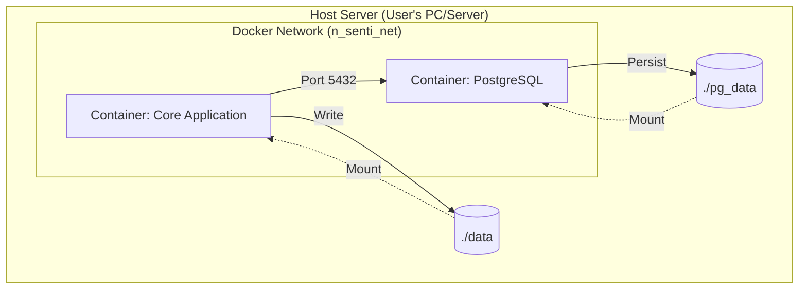

# 기술사양 명세서 (TRD)
**Project:** N-SentiTrader (뉴스 기반 감성사전 및 주가 예측 시스템)
**Version:** 1.1 (Final)
**Date:** 2025.12.16
**Platform:** Docker Container (Linux Based)
**Database:** PostgreSQL 15+

---

## 1. 시스템 아키텍처 (System Architecture)

### 1.1 배포 구조도 (Deployment View)
호스트 OS(Ubuntu 등)의 환경에 의존하지 않고, **Docker Compose**를 통해 애플리케이션 컨테이너와 DB 컨테이너가 격리된 네트워크에서 통신하는 구조입니다.



### 1.2 기술 스택 (Tech Stack)

| 구분 | 기술 요소 | 버전/사양 | 선정 이유 |
| :--- | :--- | :--- | :--- |
| **Runtime** | **Python** | 3.10-slim (Docker) | 경량화된 컨테이너 환경 |
| **Pkg Mgr** | **uv** | Latest | 로컬 개발 시 고속 의존성 해결 및 가상환경 관리 |
| **Database** | **PostgreSQL** | 15-alpine | JSONB 지원 및 분석 쿼리 최적화, 설치 용이성 |
| **Data Proc** | **Polars** | Latest | 대용량 텍스트/시계열 고속 처리 (Pandas 대체) |
| **NLP** | **Mecab (Ko)** | mecab-python3 | C++ 바인딩을 통한 고속 형태소 분석 |
| **ML/Stats** | **Scikit-learn** | Latest | Lasso 회귀 및 벡터화 표준 구현체 |
| **Scheduling** | **APScheduler** | 3.10+ | 컨테이너 내부 데몬 스케줄링 |

---

## 2. 인프라 및 배포 사양 (Infrastructure)

### 2.1 디렉토리 구조 (Container Standard)
컨테이너 내부의 작업 디렉토리는 `/app`으로 통일하며, 모든 경로는 이 기준점으로부터 상대 경로로 설정합니다.

*   **Root:** `/app`
*   **Data Mount:** `/app/data` (학습 데이터, 사전 파일)
*   **Output Mount:** `/app/output` (리포트 결과물)
*   **Config Mount:** `/app/config` (설정 파일)

### 2.2 Dockerfile 명세
```dockerfile
FROM python:3.10-slim

# 1. 시스템 의존성 설치 (Mecab, C++ 컴파일러)
RUN apt-get update && apt-get install -y --no-install-recommends \
    build-essential curl \
    mecab libmecab-dev mecab-ipadic-utf8 \
    mecab-utils \
    && rm -rf /var/lib/apt/lists/*

# 2. 작업 디렉토리 설정
WORKDIR /app

# 3. Python 라이브러리 설치
COPY requirements.txt .
RUN pip install --no-cache-dir -r requirements.txt

# 4. 소스코드 복사
COPY . .

# 5. 환경변수 기본값 설정
ENV NS_BASE_DIR="/app"
ENV NS_DATA_PATH="/app/data"
ENV TZ="Asia/Seoul"

# 6. 실행
CMD ["python", "main_scheduler.py"]
```

### 2.3 Docker Compose 설정 (docker-compose.yml)
```yaml
services:
  core-app:
    build: .
    container_name: n_senti_core
    restart: unless-stopped
    environment:
      - DB_HOST=postgres_db
      - DB_PORT=5432
      - DB_USER=myuser
      - DB_PASS=mypassword
    volumes:
      - ./data:/app/data       # 사전 파일 및 학습 데이터 영구 보존
      - ./output:/app/output   # 결과 리포트 외부 노출
      - ./logs:/app/logs       # 로그 파일 보존
    depends_on:
      - postgres_db

  postgres_db:
    image: postgres:15-alpine
    container_name: n_senti_db
    restart: always
    environment:
      POSTGRES_USER: myuser
      POSTGRES_PASSWORD: mypassword
      POSTGRES_DB: nsentitrader
    volumes:
      - ./pg_data:/var/lib/postgresql/data # DB 데이터 영구 보존
    ports:
      - "5432:5432" # 호스트에서 DBeaver 등으로 접속 가능
```

---

## 3. 데이터베이스 설계 (PostgreSQL Schema)

### 3.1 테이블 정의
PostgreSQL의 강력한 조인 기능과 인덱싱을 활용합니다.

1.  **`tb_stock_master`**
    *   `stock_code` (VARCHAR(10), PK)
    *   `market_type` (VARCHAR(10)): **'KOSPI' or 'KOSDAQ'** (시장 매칭용 핵심 키)
    *   `is_active` (BOOLEAN)

2.  **`tb_market_index`** (신규)
    *   `date` (DATE, PK)
    *   `market_type` (VARCHAR(10), PK): 'KOSPI', 'KOSDAQ'
    *   `return_rate` (DECIMAL): 지수 등락률

3.  **`tb_daily_price`**
    *   `date` (DATE, PK)
    *   `stock_code` (VARCHAR(10), PK)
    *   `close` (DECIMAL)
    *   `return_rate` (DECIMAL): 종목 등락률
    *   `excess_return` (DECIMAL): **(종목등락률 - 해당시장지수등락률)** (Target Y)

4.  **`tb_news_raw`**
    *   `id` (BIGSERIAL, PK)
    *   `stock_code` (VARCHAR(10))
    *   `title` (TEXT)
    *   `content` (TEXT)
    *   `published_at` (TIMESTAMP)
    *   `keywords` (JSONB): 전처리된 형태소 리스트 저장 (재분석 방지)

---

## 4. 상세 구현 로직 (Implementation Logic)

### 4.1 동적 경로 처리 (Path Handling)
코드 내에서 절대 경로를 배제하고 `pathlib`과 환경 변수를 활용합니다.

```python
import os
from pathlib import Path

# Docker 환경변수 혹은 기본값 사용
BASE_DIR = Path(os.getenv("NS_BASE_DIR", "/app"))
DATA_DIR = Path(os.getenv("NS_DATA_PATH", BASE_DIR / "data"))
USER_DIC_PATH = DATA_DIR / "user_dic.csv"

# 설정 파일 로드 예시
CONFIG_PATH = BASE_DIR / "config" / "config.yaml"
```

### 4.2 사용자 사전 로드 (User Dictionary)
Mecab 실행 시 Docker Volume에 마운트된 외부 CSV 파일을 참조합니다.

```python
import mecab_ko as MeCab

def get_tagger():
    if USER_DIC_PATH.exists():
        # 사용자 사전이 존재하면 적용하여 로드
        return MeCab.Tagger(f'-d /usr/lib/mecab/dic/mecab-ko-dic -u {str(USER_DIC_PATH)}')
    else:
        return MeCab.Tagger('-d /usr/lib/mecab/dic/mecab-ko-dic')
```

### 4.3 시간 감쇠 및 시장 매칭 (Key Logic)
1.  **시장 매칭 (SQL):** `tb_daily_price`와 `tb_market_index`를 조인할 때 반드시 `date`와 `market_type`이 일치해야 합니다.
2.  **시간 감쇠 (Python):**
    *   `delta_days = (prediction_date - news_date).days` (주말 포함 달력일 차이)
    *   `weight = exp(-0.5 * delta_days)`

### 4.4 앙상블 예측 (Ensemble)
*   **Main Model:** 주간 업데이트된 `Main_Dict` 사용.
*   **Buffer Model:** 최근 3일간 빈도 급증 단어 사용.
*   **OOV (미등록 단어) 처리:** 본문의 30% 이상이 OOV일 경우 `confidence_score`를 0으로 낮춤.

---

## 5. 시스템 설정 (Configuration)

`/app/config/config.yaml` 파일로 관리됩니다.

```yaml
system:
  log_level: "INFO"
  batch_time_learner: "03:00"  # 매주 일요일
  batch_time_predictor: "08:30" # 매일 아침

database:
  host: "postgres_db" # Docker Service Name
  port: 5432
  db_name: "nsentitrader"

model:
  decay_lambda: 0.5
  ensemble_ratio: 0.7 # Main 0.7 : Buffer 0.3
```

---

## 6. 개발 및 실행 가이드

이 명세서에 따라 개발자는 다음 순서로 작업을 진행합니다.

1.  **환경 구성:** `docker-compose.yml` 작성 및 실행 (`docker-compose up -d`)으로 DB 준비.
2.  **DB 초기화:** DBeaver 등으로 접속하여 Table 생성 DDL 실행.
3.  **코드 구현:** `/src` 폴더 내에 Python 모듈 구현 (`pathlib` 기반 경로 준수).
4.  **사용자 사전:** `./data/user_dic.csv`에 '2차전지', '밸류업' 등 키워드 추가.
5.  **테스트:** `docker-compose up --build`로 전체 파이프라인 가동 확인.