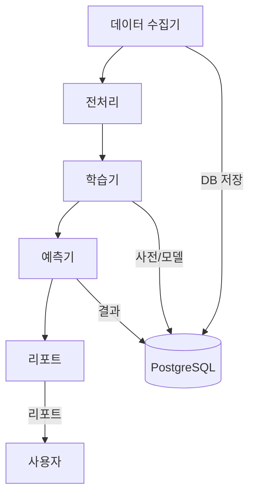

# 챕터 1. 프로젝트 개요 및 목표

## 1.1. N-SentiTrader란?
N-SentiTrader는 금융 뉴스의 텍스트 마이닝과 머신러닝을 활용하여 주식 시장의 감성(시장 심리)을 정량화하고, 이를 바탕으로 개별 종목의 초과 수익(Alpha)을 예측하는 자동화 시스템입니다.

- **핵심 키워드:** 빅데이터, 자연어처리(NLP), 감성분석, 머신러닝, 자동화, 금융 데이터

## 1.2. 개발 및 학습 대상
이 교안은 빅데이터 분석을 위한 AI 서비스 개발자 양성과정 훈련생을 대상으로 하며, 실제 현업에서 활용되는 데이터 파이프라인, 모델링, 자동화 운영의 전 과정을 실습 중심으로 익힐 수 있도록 설계되었습니다.

## 1.3. 시스템 주요 기능
- 금융 뉴스 및 주가 데이터 대량 수집 (크롤러)
- 형태소 분석 및 N-gram 기반 텍스트 전처리
- Lasso 회귀 기반 감성사전 자동 구축
- 시장 변동성 반영 Buffer 모델
- Time Decay 기반 예측 및 리포트 자동화
- Docker 기반 일관된 운영 환경 제공

## 1.4. 전체 시스템 구조 (Mermaid)



## 1.5. 실제 금융 AI 서비스 사례

- **실제 적용 예시:**
    - 네이버, 카카오 등 포털의 실시간 뉴스 기반 주가 예측 서비스
    - 증권사(예: 미래에셋, 키움증권)의 AI 기반 투자 신호 시스템
    - 해외 사례: Bloomberg, Refinitiv의 뉴스 기반 트레이딩 신호

> **참고:**
> - [Bloomberg AI Trading](https://www.bloomberg.com/company/press/bloomberg-launches-ai-powered-news-sentiment-indices/)
> - [Refinitiv News Analytics](https://www.refinitiv.com/en/products/news-analytics)

## 1.6. 데이터 흐름 상세 설명

1. **데이터 수집:**
    - 네이버 뉴스, 증권사 API 등에서 대량의 뉴스/주가 데이터를 자동 수집
2. **전처리:**
    - 형태소 분석(Mecab), 사용자 사전, N-gram 토큰화
3. **학습:**
    - Polars로 대용량 데이터 로딩, TF-IDF 벡터화, Lasso 회귀로 감성사전 구축
4. **예측:**
    - 최신 뉴스와 감성사전으로 초과수익 예측, Time Decay 적용
5. **리포트:**
    - 예측 결과를 Markdown/JSON 리포트로 자동 저장 및 시각화

## 1.7. 용어 설명 (초급자 관점)

- **N-gram:** 연속된 N개의 단어(예: '금리 인상'은 2-gram)
- **감성사전:** 단어별로 주가에 미치는 영향(가중치)을 정리한 표
- **Lasso 회귀:** 불필요한 변수를 자동으로 제거하는 머신러닝 기법
- **Time Decay:** 시간이 지날수록 뉴스의 영향력을 줄여주는 가중치
- **Buffer 모델:** 단기 이슈(급등락 키워드)를 반영하는 보조 모델
- **Docker:** 소프트웨어를 컨테이너로 포장해 어디서나 동일하게 실행하는 기술
- **APScheduler:** Python 기반 작업 스케줄러(자동화 도구)

---

> **주석:**
> - 각 모듈은 독립적으로 Docker 컨테이너에서 실행되며, 데이터는 PostgreSQL DB를 통해 공유됩니다.
> - 전체 파이프라인은 APScheduler로 자동화되어 일일/주간 단위로 운영됩니다.

## 1.8. 최소 예제 코드 (실습용)

### 1.8.1. 데이터 수집 예시 (뉴스 크롤러)
```python
import requests
from bs4 import BeautifulSoup

url = 'https://finance.naver.com/news/news_list.naver?mode=LSS2D&section_id=101&section_id2=258'
resp = requests.get(url)
soup = BeautifulSoup(resp.text, 'html.parser')
for a in soup.select('a[data-heatmap-target=".tit"]'):
    print(a.text.strip())  # 뉴스 제목 출력
```

### 1.8.2. 전처리 예시 (Mecab 형태소 분석)
```python
from konlpy.tag import Mecab
mecab = Mecab()
text = '금리 인상 기대감에 증시 상승'
tokens = mecab.morphs(text)
print(tokens)  # ['금리', '인상', '기대', '감', '에', '증시', '상승']
```

### 1.8.3. 학습 파이프라인 예시 (TF-IDF + Lasso)
```python
import polars as pl
from sklearn.feature_extraction.text import TfidfVectorizer
from sklearn.linear_model import Lasso

# 데이터 예시
texts = ['금리 인상 기대감', '증시 상승', '금리 인하 우려']
y = [1, 1, 0]  # 초과수익 여부

# TF-IDF 벡터화
vectorizer = TfidfVectorizer(tokenizer=lambda x: x.split(), ngram_range=(1,2))
X = vectorizer.fit_transform([' '.join(t.split()) for t in texts])

# Lasso 회귀
model = Lasso(alpha=0.01)
model.fit(X, y)
print(dict(zip(vectorizer.get_feature_names_out(), model.coef_)))
```

> **주석:**
> - 실제 프로젝트에서는 Polars로 대용량 데이터를 로딩하고, 위 코드를 확장해 사용합니다.
> - 각 단계별 코드는 실습/테스트용으로, 전체 파이프라인의 핵심 원리를 보여줍니다.

## 1.9. 최신 기술 트렌드 및 실전 팁 보강

### 1.9.1. Polars의 최신 기능
- **LazyFrame:** 대용량 데이터 처리 시 메모리 효율과 속도를 극대화하는 지연 실행 모드
- **Expression API:** SQL처럼 직관적으로 데이터 변환/집계 가능
- **멀티플랫폼:** Python, Rust, Node.js 등 다양한 언어 지원

### 1.9.2. scikit-learn의 실전 활용
- **Pipeline:** 전처리-학습-예측 과정을 일관된 API로 연결
- **cross-validation:** 모델의 일반화 성능을 자동으로 검증
- **API 일관성:** fit/transform/predict 등 모든 ML 알고리즘이 동일한 방식으로 사용 가능

### 1.9.3. Docker 실전 운영 팁
- **Docker Compose:** 여러 컨테이너(App, DB 등) 동시 관리
- **이미지 빌드:** `docker-compose build`로 환경 일관성 유지
- **컨테이너 로그 확인:** `docker-compose logs -f`로 실시간 모니터링

### 1.9.4. 실제 뉴스 API 활용 예시
```python
import requests
url = 'https://newsapi.ai/api/v1/article/getArticles'
params = {'keyword': '금리', 'apiKey': 'YOUR_API_KEY'}
resp = requests.get(url, params=params)
data = resp.json()
for article in data.get('articles', []):
    print(article['title'])
```

### 1.9.5. 실전 데이터 흐름 예시
- **실제 현업에서는** 뉴스 API → 데이터 수집기 → 전처리 → Polars LazyFrame → scikit-learn Pipeline → 예측/리포트 → 대시보드(시각화) 순으로 데이터가 흐름

> **참고:**
> - [Polars User Guide](https://docs.pola.rs/user-guide/)
> - [scikit-learn User Guide](https://scikit-learn.org/stable/user_guide.html)
> - [Docker 공식 가이드](https://docs.docker.com/get-started/)
> - [NewsAPI AI 공식문서](https://newsapi.ai/docs)

## 1.10. 실습 환경 구축 가이드

- **Python 패키지 설치:**
```bash
pip install polars scikit-learn beautifulsoup4 requests konlpy
```
- **Docker 설치:**
    - [공식 설치 가이드](https://docs.docker.com/get-docker/)
    - 설치 후 `docker --version`으로 정상 설치 확인
- **Docker Compose 실행:**
```bash
docker-compose up -d --build
```

## 1.11. 코드 실행 결과 예시

### 1.11.1. 뉴스 크롤러 실행 결과
```
[뉴스 제목 예시]
- "금리 인상 기대감에 증시 상승"
- "美 연준, 기준금리 동결... 시장 반응은?"
```

### 1.11.2. 형태소 분석 실행 결과
```
['금리', '인상', '기대', '감', '에', '증시', '상승']
```

### 1.11.3. Lasso 회귀 실행 결과
```
{'금리': 0.12, '인상': 0.08, '증시': 0.15, '상승': 0.10, ...}
```

## 1.12. FAQ & 오류 해결법

- **Q. Docker 컨테이너가 실행되지 않아요!**
    - A. `docker-compose logs`로 에러 메시지 확인, 포트 충돌/메모리 부족/이미지 빌드 실패 등 원인별로 조치
- **Q. API Key 오류가 발생해요!**
    - A. 뉴스 API 사용 시, 발급받은 API Key가 올바른지 확인하고, 쿼터 초과 여부도 점검
- **Q. Polars/Scikit-learn 버전 오류가 나요!**
    - A. `pip install --upgrade polars scikit-learn`으로 최신 버전 설치

> **참고:**
> - 공식 문서, Stack Overflow, GitHub Issues 등에서 유사 사례를 검색해보세요.
