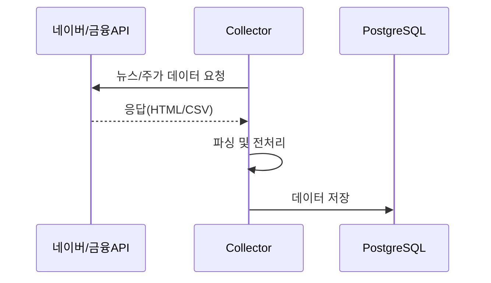

# 챕터 2. 데이터 수집 및 저장 시스템

## 2.1. 데이터 수집(Collector) 개요
- **목적:** 금융 뉴스와 주가 데이터를 대량으로 자동 수집하여 분석의 기초 데이터를 확보합니다.
- **주요 기술:** Python, BeautifulSoup, Requests, FinanceDataReader, Docker, Cloudflare WARP(VPN)

## 2.2. 뉴스 크롤러 구조
- **네이버 뉴스 SDS(Smart Design System) 레이아웃**에 대응하여, 최신 뉴스 페이지 구조를 파싱합니다.
- **중복 제거:** difflib.SequenceMatcher를 활용해 90% 이상 유사한 뉴스는 1건만 저장합니다.
- **페이지네이션 우회:** 20페이지 제한을 우회하여 최대 1000건까지 수집 가능.
- **VPN 연동:** Cloudflare WARP를 통해 IP 차단을 방지하며, 대량 수집이 가능합니다.

## 2.3. 주가/지수 데이터 수집
- **FinanceDataReader**를 활용해 KOSPI/KOSDAQ 전 종목의 일별 시세 및 시장 지수를 수집합니다.
- **초과수익률(Excess Return)** 계산을 위해 시장 지수와 개별 종목의 등락률을 동시 저장합니다.

## 2.4. 데이터베이스 설계
- **PostgreSQL 15+**를 사용하며, 주요 테이블은 다음과 같습니다.
    - `tb_news_content`: 뉴스 원문, 제목, 전처리된 토큰(JSONB)
    - `tb_news_mapping`: 뉴스ID-종목코드 매핑, Impact Date
    - `tb_daily_price`: 종목별 일별 시세, 초과수익률
    - `tb_sentiment_dict`: 감성사전(단어, 가중치, 버전)

## 2.5. 데이터 흐름도 (Mermaid)



## 2.6. 실제 금융 데이터 API 및 크롤러 구조 보강

- **실제 활용 예시:**
    - 네이버 뉴스, NewsAPI, Yahoo Finance, Alpha Vantage 등 다양한 데이터 소스 활용 가능
    - 국내는 네이버 뉴스/증권, 해외는 NewsAPI, Yahoo Finance 등으로 확장 가능

- **초급자 관점 용어 설명:**
    - **크롤러(Crawler):** 웹사이트에서 원하는 정보를 자동으로 수집하는 프로그램
    - **API:** Application Programming Interface, 외부 서비스의 데이터를 코드로 받아오는 창구
    - **중복 제거:** 같은 뉴스가 여러 번 수집되는 것을 방지하는 로직
    - **VPN:** 인터넷 우회 접속 기술, IP 차단 방지에 활용
    - **CSV:** 데이터를 표 형태로 저장하는 파일 포맷(Comma-Separated Values)
    - **JSONB:** PostgreSQL에서 JSON 데이터를 효율적으로 저장하는 데이터 타입

- **실전 데이터 흐름:**
    1. 뉴스/주가 데이터 요청 (API/크롤러)
    2. HTML/CSV/JSON 응답 수신
    3. 파싱(BeautifulSoup 등) 및 전처리(중복 제거, 토큰화)
    4. DB 저장 (PostgreSQL)
    5. 이후 단계(전처리/학습/예측)에서 재사용

## 2.7. 최소 예제 코드 (실습용)

### 2.7.1. 뉴스 데이터 수집 및 중복 제거 예시
```python
import requests
from bs4 import BeautifulSoup
from difflib import SequenceMatcher

url = 'https://finance.naver.com/news/news_list.naver?mode=LSS2D&section_id=101&section_id2=258'
resp = requests.get(url)
soup = BeautifulSoup(resp.text, 'html.parser')
news_list = []
for a in soup.select('a[data-heatmap-target=".tit"]'):
    title = a.text.strip()
    # 중복(유사) 뉴스 제거
    if not any(SequenceMatcher(None, title, n).ratio() > 0.9 for n in news_list):
        news_list.append(title)
print(news_list)
```

### 2.7.2. 주가 데이터 수집 예시
```python
import FinanceDataReader as fdr
# KOSPI 전체 종목 코드
stocks = fdr.StockListing('KOSPI')
# 삼성전자 일별 시세
df = fdr.DataReader('005930', '2023-01-01', '2023-12-31')
print(df.head())
```

### 2.7.3. PostgreSQL DB 저장 예시
```python
import psycopg2
conn = psycopg2.connect(dbname='stockdb', user='user', password='pw', host='localhost')
cur = conn.cursor()
cur.execute('INSERT INTO tb_news_content (title, content) VALUES (%s, %s)', ('뉴스제목', '본문'))
conn.commit()
cur.close()
conn.close()
```

> **주석:**
> - 실습 코드는 실제 프로젝트의 핵심 로직을 단순화한 예시입니다.
> - DB 연결 정보는 환경에 맞게 수정하세요.

---

> **주석:**
> - 데이터 수집기는 Docker 컨테이너에서 독립적으로 실행되며, 장애 발생 시 재시작이 용이합니다.
> - 수집된 데이터는 DB에 저장되어, 이후 전처리 및 학습 단계에서 재사용됩니다.

---

## 2.8. 실습 환경별 실행 안내

- **로컬 환경:**
    - Python 3.9+ 설치, `pip install -r requirements.txt`
    - PostgreSQL 설치(15+ 권장), DB 계정/포트 확인
- **Colab 환경:**
    - `!pip install requests beautifulsoup4 finance-datareader psycopg2-binary`
    - 외부 DB 연결 시 방화벽/포트포워딩 필요
- **Docker 환경:**
    - `docker-compose up -d --build`로 Collector/DB 컨테이너 일괄 실행
    - 환경변수(.env)로 DB 정보 관리, 컨테이너 재시작 자동화

## 2.9. 데이터 품질 관리 및 실전 팁

- **결측치/이상치 처리:**
    - 수집 데이터에 결측치(null)나 비정상 값이 포함될 수 있으므로, DB 저장 전 필터링 권장
- **중복 데이터 방지:**
    - 뉴스 제목/본문 해시값 저장, SequenceMatcher 등으로 유사도 체크
- **인코딩 문제:**
    - `resp.encoding = 'utf-8'` 등으로 한글 깨짐 방지
- **실전 팁:**
    - 크롤링 시 User-Agent 헤더 지정, 요청 간 sleep(0.5~1초)로 차단 방지
    - VPN/프록시 활용 시 네트워크 오류 발생 가능, 예외처리 필수

## 2.10. 실행 결과 예시

### 뉴스 데이터 수집 결과
```
['금리 인상 기대감에 증시 상승', '美 연준, 기준금리 동결... 시장 반응은?', ...]
```
### 주가 데이터 수집 결과
```
           Open   High    Low  Close    Volume  Change
Date
2023-01-02  60000  61000  59500  60500  1234567   0.01
...
```

## 2.11. DB 스키마 예시(SQL)

```sql
CREATE TABLE tb_news_content (
    id SERIAL PRIMARY KEY,
    title TEXT,
    content TEXT,
    tokens JSONB,
    created_at TIMESTAMP DEFAULT NOW()
);

CREATE TABLE tb_daily_price (
    id SERIAL PRIMARY KEY,
    stock_code VARCHAR(10),
    date DATE,
    open NUMERIC,
    high NUMERIC,
    low NUMERIC,
    close NUMERIC,
    volume BIGINT,
    excess_return NUMERIC
);
```

## 2.12. 전체 워크플로우/자동화 예시

- **APScheduler 활용 예시:**
```python
from apscheduler.schedulers.blocking import BlockingScheduler
def collect_job():
    # 데이터 수집/저장 함수 호출
    pass
sched = BlockingScheduler()
sched.add_job(collect_job, 'cron', hour=6)
sched.start()
```
- **Docker Compose 예시:**
```yaml
version: '3'
services:
  collector:
    build: .
    environment:
      - DB_HOST=db
      - DB_USER=user
      - DB_PASSWORD=pw
    depends_on:
      - db
  db:
    image: postgres:15
    environment:
      - POSTGRES_USER=user
      - POSTGRES_PASSWORD=pw
      - POSTGRES_DB=stockdb
    ports:
      - "5432:5432"
```

## 2.13. FAQ & 트러블슈팅

- **Q. 크롤링 중 IP 차단/403 오류가 발생해요!**
    - A. User-Agent 헤더 추가, VPN/프록시 사용, 요청 간 딜레이 적용
- **Q. DB 연결 오류(psycopg2 OperationalError)!**
    - A. DB 주소/포트/계정 확인, Docker 컨테이너 네트워크 설정 점검
- **Q. 한글이 깨져서 저장돼요!**
    - A. `conn.set_client_encoding('UTF8')` 또는 DB 인코딩 확인
- **Q. Colab에서 DB 연결이 안 돼요!**
    - A. 외부 접속 허용, 방화벽/포트포워딩 설정 필요
