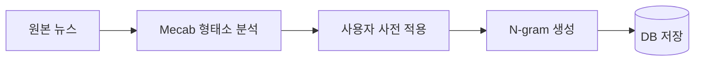

# 챕터 3. 텍스트 전처리 및 자연어 처리 시스템

## 3.1. 전처리(Preprocessing) 개요
- **목적:** 수집된 뉴스 텍스트를 분석 가능한 형태로 변환합니다.
- **주요 기술:** Mecab-ko(형태소 분석기), 사용자 사전, N-gram 생성

## 3.2. 형태소 분석 및 사용자 사전
- **Mecab-ko**를 활용해 한국어 뉴스 본문을 형태소 단위로 분해합니다.
- **사용자 사전:** '2차전지', '밸류업' 등 금융 신조어를 별도 관리하여 분석 정확도를 높입니다.

## 3.3. N-gram(1~3) 토큰화
- **Unigram, Bigram, Trigram** 단위로 토큰을 생성하여, 단어뿐 아니라 구문(문맥)까지 반영합니다.
- 예시: '금리 인상' → ['금리', '인상', '금리 인상']

## 3.4. 데이터 저장 및 활용
- 전처리된 토큰은 `tb_news_content.keywords`(JSONB) 필드에 저장됩니다.
- 이후 학습 단계에서 TF-IDF 벡터화의 입력값으로 사용됩니다.

## 3.5. 전처리 파이프라인 예시 (Mermaid)



---

> **주석:**
> - 형태소 분석기는 Docker 컨테이너 내에서 mecab-python3 패키지로 실행됩니다.
> - 사용자 사전은 `data/user_dic.csv`로 관리하며, 새로운 신조어가 등장할 때마다 갱신합니다.

## 3.6. 실전 전처리 코드 예시
```python
import re
from konlpy.tag import Mecab
import pandas as pd

def clean_text(text):
    text = re.sub(r'<[^>]+>', '', text)  # HTML 태그 제거
    text = re.sub(r'[^\w\s]', '', text)  # 특수문자 제거
    text = re.sub(r'\s+', ' ', text).strip()
    return text

mecab = Mecab()
def tokenize(text):
    return mecab.morphs(text)

def ngram(tokens, n=2):
    return [' '.join(tokens[i:i+n]) for i in range(len(tokens)-n+1)]

data = pd.DataFrame({'text': ['금리 인상 기대감에 증시 상승', '美 연준, 기준금리 동결']})
data['clean'] = data['text'].apply(clean_text)
data['tokens'] = data['clean'].apply(tokenize)
data['bigrams'] = data['tokens'].apply(lambda x: ngram(x, 2))
print(data[['text', 'tokens', 'bigrams']])
```

## 3.7. 실습 환경별 안내
- **로컬:** `pip install konlpy mecab-python3 pandas`
- **Colab:** `!apt-get install g++ openjdk-8-jdk python3-dev python3-pip curl && pip install konlpy mecab-python3 pandas`
- **Docker:** Dockerfile에 mecab, konlpy, pandas 설치 명령 추가

## 3.8. 품질 관리 및 실전 팁
- **불용어 제거:** 불필요한 조사/접속사 등은 별도 리스트로 관리 후 필터링
- **사용자 사전:** 도메인 특화 용어(예: 종목명, 금융용어)는 mecab 사용자 사전 등록
- **인코딩:** 한글 데이터는 항상 UTF-8 인코딩 사용
- **실전 팁:** 대용량 처리 시 Polars, 병렬처리(multiprocessing) 활용

## 3.9. 실행 결과 예시
```
                text                  tokens                bigrams
0  금리 인상 기대감에 증시 상승  [금리, 인상, 기대, 감, 에, 증시, 상승]  [금리 인상, 인상 기대, 기대 감, 감 에, 에 증시, 증시 상승]
1    美 연준, 기준금리 동결        [美, 연준, 기준, 금리, 동결]        [美 연준, 연준 기준, 기준 금리, 금리 동결]
```

## 3.10. 전처리 워크플로우(자동화 예시)
```python
from apscheduler.schedulers.blocking import BlockingScheduler

def preprocess_job():
    # 전처리 함수 호출
    pass

sched = BlockingScheduler()
sched.add_job(preprocess_job, 'cron', hour=7)
sched.start()
```

## 3.11. FAQ & 트러블슈팅
- **Q. Mecab 설치가 안 돼요!**
    - A. OS별 설치법(Colab, Ubuntu, Mac 등) 공식 문서 참고, 의존 패키지 사전 설치 필요
- **Q. 한글이 깨져요!**
    - A. 파일 저장/불러오기 시 encoding='utf-8' 지정
- **Q. 사용자 사전 적용이 안 돼요!**
    - A. mecab 사용자 사전 경로/포맷 확인, 재빌드 필요

> **참고:**
> - [konlpy 공식문서](https://konlpy.org/ko/latest/)
> - [Mecab 설치 가이드](https://konlpy.org/ko/latest/install/)
> - [Polars User Guide](https://docs.pola.rs/user-guide/)

## 3.12. 사용자 사전(User Dictionary) 등록 방법

실전에서는 종목명, 약어, 신조어 등 도메인 전용 단어를 사용자 사전에 등록해야 분석 정확도가 향상됩니다.

1) 사용자 사전 예시 포맷(`data/user_dic.csv`)

```csv
word,pos
2차전지,NNG
밸류업,NNG
LG에너지솔루션,NNP
```

2) mecab 사용자 사전 빌드(일반적인 절차)

- CSV 준비: `data/user_dic.csv`를 UTF-8로 저장
- 사용자 사전 빌드(예시 명령):

```bash
# mecab-ko-dic 사용 시 예시 (환경에 따라 경로가 다름)
mecab-dict-index -d /usr/lib/mecab/dic/mecab-ko-dic -u ./user.dic -f utf-8 -t utf-8 data/user_dic.csv
```

3) 시스템에 적용

- 빌드된 `user.dic`를 mecab이 참조하도록 설정하거나, mecab 인스턴스 생성 시 사용자 사전 경로를 지정합니다.

4) 간단한 확인

```bash
# mecab로 단어 인식 테스트
echo "2차전지 관련 뉴스" | mecab -d /usr/lib/mecab/dic/mecab-ko-dic
```

참고: 플랫폼(ubuntu, macOS, Colab)과 설치된 mecab 배포판에 따라 명령어와 사전 경로가 달라집니다. 위 명령은 예시이며, 실제 환경 경로를 확인해 적용하세요.

## 3.13. 대용량 처리 예시 (Polars + 멀티프로세스)

Polars를 사용하면 CSV를 빠르게 읽고, 청크 단위 또는 병렬로 전처리할 수 있습니다. 아래는 간단한 예시입니다.

```python
import polars as pl
from konlpy.tag import Mecab
from multiprocessing import Pool

mecab = Mecab()

def tokenize(text: str) -> str:
    if not text:
        return ''
    return ' '.join(mecab.morphs(text))

def parallel_tokenize(series, processes=4):
    with Pool(processes) as p:
        return p.map(tokenize, series)

# CSV를 Polars로 읽고 병렬 토큰화 적용
df = pl.read_csv('data/news_large.csv')
texts = df['content'].to_list()
tokens = parallel_tokenize(texts, processes=4)
df = df.with_columns(pl.Series('tokens', tokens))
df.write_csv('data/news_tokenized.csv')
```

주의: `konlpy`/`Mecab` 객체는 프로세스 간 직렬화되지 않으므로, 각 워커에서 초기화하는 방식으로 구현해야 합니다(위 코드는 간단한 예시이며, 실전에서는 워커 초기화 로직을 추가하세요).

## 3.14. 스크립트 예시 및 요구사항

프로젝트 루트에 `requirements.txt`를 두고 개발/실습 환경을 통일하세요. 예시 패키지:

```
konlpy
mecab-python3
polars
pandas
apscheduler
```

간단한 빌드 스크립트(예: `scripts/build_mecab_userdic.sh`)를 만들어 사용자 사전 빌드 과정을 자동화하면 편리합니다.

---

끝으로, 챕터 3에 추가할 더 구체적인 항목(예: 사용자 사전 CSV 템플릿 자동 생성 스크립트, 워커 초기화용 토큰화 서비스 코드 등)이 있으면 알려주시면 바로 추가하겠습니다.
