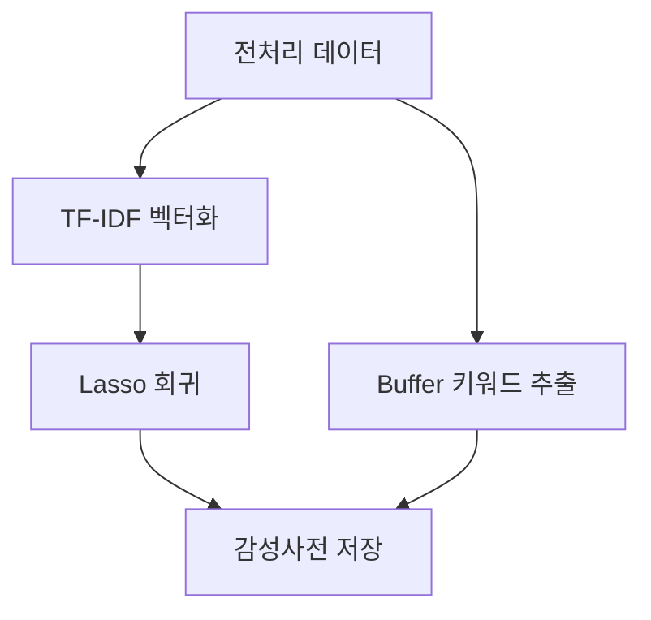

# 챕터 4. 머신러닝 기반 감성사전 구축 및 모델 학습

## 4.1. 학습 시스템 개요
- **목적:** 전처리된 뉴스 데이터를 바탕으로 감성사전(단어별 가중치)와 예측 모델을 자동으로 구축합니다.
- **주요 기술:** Polars(대용량 데이터 처리), scikit-learn(Lasso 회귀), TF-IDF 벡터화

## 4.2. 데이터 로딩 및 벡터화
- **Polars** 라이브러리를 사용해 대용량 데이터를 효율적으로 로딩합니다.
- **TF-IDF 벡터화:** 전처리된 N-gram 토큰을 TF-IDF 행렬로 변환하여, 단어의 중요도를 수치화합니다.

## 4.3. Lasso 회귀 기반 감성사전 구축
- **Lasso 회귀**를 통해 초과수익률(Excess Return)과 가장 상관관계가 높은 단어(특징)를 자동으로 선별합니다.
- **감성사전:** Lasso의 비제로(Non-zero) 계수를 가진 단어와 가중치를 DB(`tb_sentiment_dict`)에 저장합니다.

## 4.4. Buffer 모델(단기 변동성 반영)
- 최근 3일간 급등락을 유발한 단기 이슈 키워드를 별도 Buffer 사전으로 관리합니다.
- Buffer 사전은 메인 감성사전과 가중치 비율(예: Main 0.7, Buffer 0.3)로 합산되어 예측에 활용됩니다.

## 4.5. 학습 파이프라인 예시 (Mermaid)

---

> **주석:**
> - Polars는 Pandas 대비 메모리 사용량이 적고, 속도가 빠르므로 대용량 뉴스 데이터에 적합합니다.
> - Lasso 회귀는 불필요한 단어(불용어)를 자동으로 제거하는 효과가 있습니다.
> - 학습 결과는 버전 관리되어, 모델 개선 및 재현이 용이합니다.
