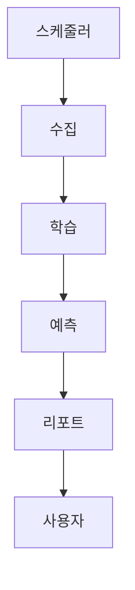

# 챕터 5. 예측, 리포팅 및 자동화 운영

## 5.1. 예측 시스템 개요
- **목적:** 학습된 감성사전과 Buffer 사전을 활용해, 최신 뉴스 기반의 초과수익(Alpha) 예측 및 매수/관망 신호를 생성합니다.
- **주요 기술:** Time Decay(시간 가중치), Scoring, 리포트 자동화

## 5.2. Time Decay 기반 예측
- 뉴스의 영향력은 시간이 지날수록 감소하므로, **달력일(Calendar Day)** 기준으로 가중치를 적용합니다.
- 예: `exp(-decay_rate * (현재일 - 뉴스일))`로 점수 산출

## 5.3. 신호 생성 및 리포트
- 예측 결과는 매수(BUY), 관망(HOLD) 등 신호로 변환되어, Markdown/JSON 리포트로 자동 저장됩니다.
- 리포트에는 Top Keywords, 예측 신호, 근거 뉴스 목록이 포함됩니다.

## 5.4. 자동화 운영 (APScheduler)
- 전체 파이프라인은 APScheduler로 스케줄링되어, 매일 00:00(수집), 04:00(학습), 08:30(예측/리포트) 순으로 자동 실행됩니다.
- 장애 발생 시 재시작이 용이하도록 Docker 컨테이너 기반으로 설계되었습니다.

## 5.5. 운영 파이프라인 예시 (Mermaid)

---

> **주석:**
> - 리포트는 `output/` 폴더에 자동 저장되며, Streamlit 등 대시보드로 시각화가 가능합니다.
> - APScheduler는 Python 기반 스케줄러로, cron과 유사하게 반복 작업을 자동화합니다.
