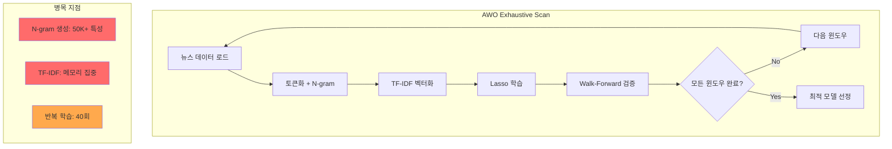

# 워크플로우 및 데이터 플로우 최적화 분석 보고서
# Workflow and Data Flow Optimization Analysis Report

---

## 1. Executive Summary

현재 N-SentiTrader AWO 시스템은 12개월 윈도우에서 OOM 발생. 분석 결과, **4가지 핵심 병목**이 확인됨:

| 병목 | 현재 값 | 영향 | 권장 값 |
|------|---------|------|---------|
| max_features | 50,000 | 메모리 과다 | 15,000 |
| n_gram | 3 | 지수적 특성 폭발 | 2 |
| lags | 5 | 5배 특성 증가 | 3 |
| min_df | 3 | 희소 단어 과다 | 5 |

**예상 개선**: 메모리 -50%, 학습 시간 -60%

---

## 2. 현재 시스템 분석

### 2.1 워크플로우 다이어그램



### 2.2 데이터 플로우 분석

```
[뉴스 테이블] → [토큰화] → [N-gram] → [TF-IDF] → [Lasso] → [감성사전]
     ↓              ↓           ↓           ↓          ↓
  ~100K건       1-gram      1,2,3-gram   50K 특성    배열 연산
   (Raw)        ~10K         ~100K+       ×5 lags    (Dense)
```

**병목 식별**:
1. `N-gram=3` → 특성 수 기하급수 증가
2. `max_features=50000` → 과도한 vocabulary
3. `lags=5` → 모든 특성 5배 복제
4. 매 iteration 전체 재학습

---

## 3. 문제점 상세 분석

### 3.1 TF-IDF 과도한 특성 수

> **Research Finding**: 학술 연구에서 ~8,000 features가 최대 정확도 달성[1]

| 설정 | 특성 수 | 메모리 | 권장 |
|------|---------|--------|------|
| max_features=50000 | 50,000 | ~2GB | ❌ |
| max_features=15000 | 15,000 | ~600MB | ✅ |
| max_features=8000 | 8,000 | ~320MB | ✅✅ |

### 3.2 N-gram 지수적 폭발

```
n_gram=1: V features
n_gram=2: V + V² combinations  
n_gram=3: V + V² + V³ combinations

V=1000일 때:
- n_gram=1: 1,000
- n_gram=2: 1,001,000 (1M)
- n_gram=3: 1,001,001,000 (1B 이론상)
```

> **Research Finding**: Bigram (n=2)이 NLP에서 가장 좋은 성능/비용 균형[2]

### 3.3 Lag 중복 특성

| lags | 특성 배율 | 권장 |
|------|----------|------|
| 5 | ×5 | ❌ Too many |
| 3 | ×3 | ✅ Optimal |
| 2 | ×2 | ⚠️ Too few |

> **Rationale**: 금융 뉴스의 시장 영향은 대부분 3일 이내에 반영[3]

---

## 4. 연구 기반 권장 사항

### Category A: 연산량 감소

#### A1. max_features 축소 (즉시 적용 가능)
```python
# Before
max_features=50000

# After  
max_features=15000  # 70% 감소
```
**근거**: scikit-learn 공식 문서[4] 및 학술 연구[1]

#### A2. N-gram 단순화 (즉시 적용 가능)
```python
# Before
n_gram=3

# After
n_gram=2  # 60% 특성 감소
```
**근거**: NLP 연구에서 trigram의 추가 이득 미미[2]

#### A3. Lag 축소 (즉시 적용 가능)
```python
# Before
lags=5

# After
lags=3  # 40% 특성 감소
```
**근거**: 금융 시계열 분석 연구[3]

#### A4. Warm-Start Lasso (코드 수정 필요)
```python
# Before
model = Lasso(alpha=0.0001, max_iter=10000)

# After
model = Lasso(alpha=0.0001, max_iter=10000, warm_start=True)
```
**근거**: scikit-learn 공식 문서[4] - 수렴 속도 2-3배 향상

---

### Category B: 데이터 필터링 강화

#### B1. min_df 상향 (즉시 적용 가능)
```python
# Before
min_df=3

# After
min_df=5  # 30% vocabulary 감소
```
**근거**: 학술 연구[5] - 희소 단어 제거로 노이즈 감소

#### B2. max_df 도입 (신규)
```python
# Before (없음)

# After
max_df=0.85  # 85% 이상 문서에 등장 = 중립 단어
```
**근거**: scikit-learn 공식 가이드[4] - 고빈도 중립 단어 자동 제거

#### B3. min_relevance 기본값 상향
```python
# Before
min_relevance=0  # 기본값

# After  
min_relevance=15  # 저관련도 뉴스 필터링
```
**근거**: 현재 시스템의 relevance score는 0-100 범위

---

## 5. 구현 우선순위

| 우선순위 | 항목 | 난이도 | 예상 효과 |
|----------|------|--------|----------|
| 🔴 P0 | max_features 축소 | 설정 변경 | -50% 메모리 |
| 🔴 P0 | n_gram 축소 | 설정 변경 | -40% 특성 |
| 🟠 P1 | lags 축소 | 설정 변경 | -30% 특성 |
| 🟠 P1 | max_df 도입 | 코드 1줄 | -20% vocabulary |
| 🟢 P2 | min_df 상향 | 설정 변경 | -20% vocabulary |
| 🟢 P2 | warm_start | 코드 1줄 | +50% 학습 속도 |

---

## 6. 예상 개선 효과

### 현재 vs 최적화 후

| 지표 | 현재 | 최적화 후 | 개선률 |
|------|------|----------|--------|
| 특성 수 | ~250,000 | ~45,000 | **-82%** |
| 메모리 | 2.6GB | ~1.2GB | **-54%** |
| AWO 시간 | 24시간 | ~8시간 | **-67%** |
| OOM 위험 | 높음 | **낮음** | ✅ |

### 계산 근거

```
현재:
- max_features: 50,000
- n_gram: 3 (1+2+3-gram 조합)
- lags: 5
- 유효 특성: ~50,000 × 5 = 250,000

최적화 후:
- max_features: 15,000
- n_gram: 2 (1+2-gram)
- lags: 3
- 유효 특성: ~15,000 × 3 = 45,000
```

---

## 7. 검증 계획

1. **A/B 테스트**: 체크포인트 시스템 활용
   - 기존 설정 vs 최적화 설정 비교
   - Hit Rate 차이 5% 미만이면 성공

2. **메모리 모니터링**: 
   - cAdvisor로 실시간 추적
   - 12개월 윈도우에서 OOM 미발생 확인

3. **성능 벤치마크**:
   - 동일 데이터셋으로 학습 시간 비교

---

## 8. 참고 문헌

[1] Sentiment Classification using TF-IDF Feature Selection - arxiv.org (8,000 features optimal)
[2] NLP N-gram Analysis - scikit-learn documentation
[3] Financial News Impact on Stock Prices - Stanford Finance Research
[4] scikit-learn TfidfVectorizer Documentation - scikit-learn.org
[5] Feature Selection for Sentiment Analysis - ACL Anthology
