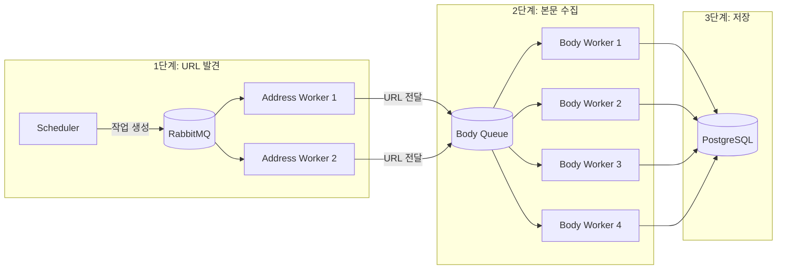
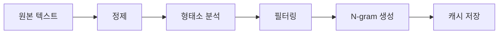
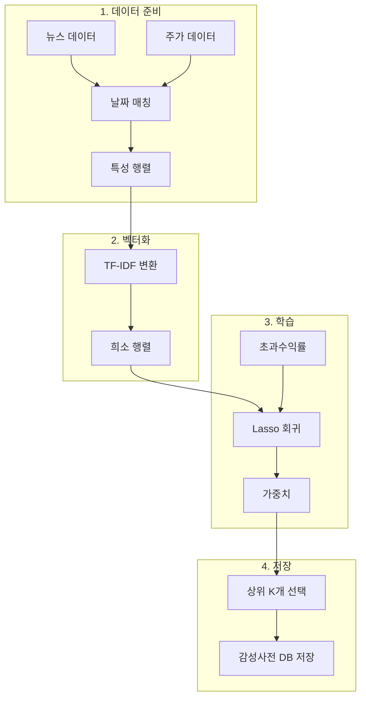
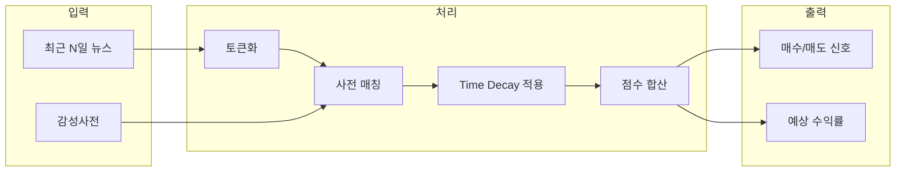
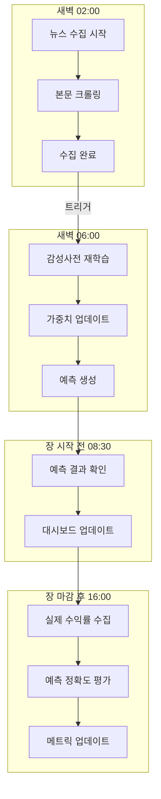
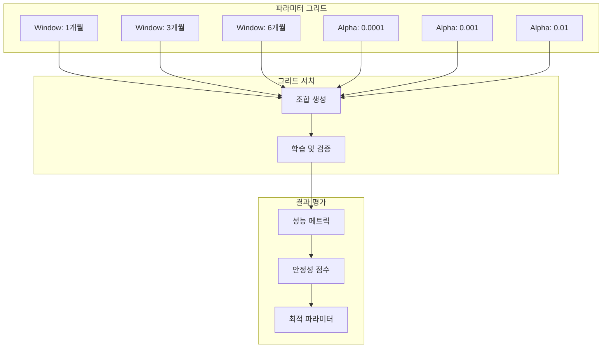

# N-SentiTrader 워크플로우 가이드
## Workflow Guide for Beginners

> 이 문서는 N-SentiTrader의 핵심 워크플로우를 **초급 개발자**가 이해할 수 있도록 상세히 설명합니다.

---

## 📋 목차
1. [데이터 수집 워크플로우](#1-데이터-수집-워크플로우)
2. [텍스트 전처리 워크플로우](#2-텍스트-전처리-워크플로우)
3. [모델 학습 워크플로우](#3-모델-학습-워크플로우)
4. [예측 워크플로우](#4-예측-워크플로우)
5. [자동화 운영 워크플로우](#5-자동화-운영-워크플로우)
6. [백테스트 워크플로우](#6-백테스트-워크플로우)

---

## 1. 데이터 수집 워크플로우

### 개요
뉴스와 주가 데이터를 자동으로 수집하는 **분산 크롤링 시스템**입니다.

### 아키텍처



### 주요 컴포넌트

| 컴포넌트 | 파일 | 역할 |
|----------|------|------|
| **Address Worker** | `run_address_worker.py` | 뉴스 목록 페이지에서 URL 발견 |
| **Body Worker** | `run_worker.py` | 개별 뉴스 본문 크롤링 |
| **News Collector** | `collector/news.py` | 크롤링 로직 핵심 구현 |

### 핵심 코드 예시

```python
# 뉴스 URL 발견
def discover_urls(stock_code: str, page: int):
    """네이버 뉴스 검색 결과에서 URL 추출"""
    url = f"https://search.naver.com/search.naver?where=news&query={stock_code}"
    response = get_robust_session().get(url)
    soup = BeautifulSoup(response.text, 'html.parser')
    
    for link in soup.select('a.news_tit'):
        yield {
            'url': link['href'],
            'title': link.text,
            'stock_code': stock_code
        }
```

### VPN 로테이션

크롤링 차단을 피하기 위해 **Warp VPN 자동 로테이션**을 사용합니다:

```python
# 지수 백오프 재시도
def get_robust_session():
    """차단 시 자동 VPN 교체"""
    session = requests.Session()
    retries = Retry(
        total=3,
        backoff_factor=0.5,
        status_forcelist=[403, 429, 500]
    )
    session.mount('https://', HTTPAdapter(max_retries=retries))
    return session
```

---

## 2. 텍스트 전처리 워크플로우

### 개요
수집된 뉴스 텍스트를 **머신러닝에 적합한 형태**로 변환합니다.

### 처리 파이프라인



### 단계별 예시

| 단계 | 입력 | 출력 |
|------|------|------|
| **원본** | "삼성전자, AI 반도체 투자 확대 발표!" | - |
| **정제** | "삼성전자 AI 반도체 투자 확대 발표" | 특수문자 제거 |
| **형태소 분석** | ["삼성전자", "AI", "반도체", "투자", "확대", "발표"] | MeCab 토큰화 |
| **필터링** | ["삼성전자", "AI", "반도체", "투자", "확대"] | 불용어 제거 |
| **N-gram** | ["삼성전자", "AI", "반도체", "AI_반도체", "반도체_투자"] | 2-gram 생성 |

### MeCab 사용자 사전

종목명과 금융 용어를 정확히 인식하도록 **사용자 사전**을 활용합니다:

```csv
# user_dic.csv
삼성전자,,,1,NNP,*,T,삼성전자,*,*,*,*
SK하이닉스,,,1,NNP,*,F,SK하이닉스,*,*,*,*
금리인상,,,1,NNG,*,T,금리인상,*,*,*,*
```

### 핵심 코드

```python
from konlpy.tag import Mecab

class Tokenizer:
    def __init__(self):
        self.mecab = Mecab(dicpath='/app/data/user_dic')
    
    def tokenize(self, text: str, ngram: int = 2) -> list:
        """텍스트를 N-gram 토큰 리스트로 변환"""
        # 1. 형태소 분석
        morphs = self.mecab.morphs(text)
        
        # 2. 불용어 필터링
        tokens = [m for m in morphs if len(m) > 1]
        
        # 3. N-gram 생성
        ngrams = []
        for i in range(len(tokens) - ngram + 1):
            ngrams.append('_'.join(tokens[i:i+ngram]))
        
        return tokens + ngrams
```

---

## 3. 모델 학습 워크플로우

### 개요
**Lasso 회귀**를 사용하여 각 단어가 주가에 미치는 영향력(가중치)을 학습합니다.

### 학습 파이프라인



### Lasso 회귀란?

**L1 정규화**를 사용하여 불필요한 변수를 자동으로 제거하는 회귀 기법입니다.

```
목적함수: minimize ||y - Xβ||² + α||β||₁
```

| 기호 | 의미 | 예시 |
|------|------|------|
| `y` | 목표 변수 (초과수익률) | [0.02, -0.01, 0.03, ...] |
| `X` | TF-IDF 행렬 | (10000 x 50000) 희소 행렬 |
| `β` | 단어별 가중치 | {"금리": 0.05, "하락": -0.03, ...} |
| `α` | 정규화 강도 | 0.001 (하이퍼파라미터) |

### 왜 Lasso인가?

| 특성 | Lasso | Ridge | 일반 회귀 |
|------|-------|-------|----------|
| **희소성** | ✅ 불필요 변수 = 0 | ❌ 모든 변수 사용 | ❌ 모든 변수 사용 |
| **해석 가능성** | ✅ 중요 단어만 추출 | ❌ 모든 단어 포함 | ❌ 과적합 위험 |
| **메모리 효율** | ✅ 희소 행렬 활용 | ❌ 밀집 행렬 필요 | ❌ 밀집 행렬 필요 |

### 감성사전 예시

학습 결과로 생성되는 **감성사전** (단어 → 가중치):

| 단어 | 가중치 | 해석 |
|------|--------|------|
| AI_반도체 | +0.082 | 상승에 기여 |
| 금리_인하 | +0.065 | 상승에 기여 |
| 실적_호조 | +0.058 | 상승에 기여 |
| 하락_우려 | -0.071 | 하락에 기여 |
| 적자_전환 | -0.089 | 하락에 기여 |

### 핵심 코드

```python
from sklearn.feature_extraction.text import TfidfVectorizer
from sklearn.linear_model import Lasso

class LassoLearner:
    def __init__(self, stock_code: str, alpha: float = 0.001):
        self.stock_code = stock_code
        self.vectorizer = TfidfVectorizer(
            tokenizer=lambda x: x,  # 이미 토큰화됨
            max_features=50000,
            min_df=3  # 최소 3개 문서에 등장
        )
        self.model = Lasso(alpha=alpha)
    
    def train(self, tokens_list: list, returns: list):
        """감성사전 학습"""
        # TF-IDF 벡터화 (Generator로 메모리 최적화)
        X = self.vectorizer.fit_transform(
            t for t in tokens_list
        )
        
        # Lasso 회귀 학습
        self.model.fit(X, returns)
        
        # 감성사전 추출
        feature_names = self.vectorizer.get_feature_names_out()
        weights = self.model.coef_
        
        return {name: w for name, w in zip(feature_names, weights) if w != 0}
```

---

## 4. 예측 워크플로우

### 개요
학습된 감성사전을 사용하여 **오늘의 예측**을 생성합니다.

### 예측 파이프라인



### Time Decay (시간 감쇠)

오래된 뉴스일수록 영향력이 감소합니다:

```
weight = exp(-decay_rate × lag_days)
```

| 경과일 | 감쇠율 0.3 적용 | 해석 |
|--------|----------------|------|
| 0일 (오늘) | 1.00 | 100% 영향력 |
| 1일 | 0.74 | 74% 영향력 |
| 2일 | 0.55 | 55% 영향력 |
| 3일 | 0.41 | 41% 영향력 |
| 5일 | 0.22 | 22% 영향력 |

### 신호 생성 로직

```python
def generate_signal(score: float, intensity: float) -> str:
    """점수와 강도를 기반으로 투자 신호 생성"""
    if score > 0.5 and intensity > 2.0:
        return "Strong Buy"
    elif score > 0.2:
        return "Cautious Buy"
    elif score < -0.5 and intensity > 2.0:
        return "Strong Sell"
    elif score < -0.2:
        return "Cautious Sell"
    else:
        return "Observation"
```

### 예측 결과 예시

| 필드 | 값 | 설명 |
|------|-----|------|
| **종목** | 삼성전자 (005930) | 분석 대상 |
| **감성 점수** | +0.42 | 긍정적 |
| **강도** | 2.8 | 높은 확신도 |
| **예상 수익률** | +1.2% | 기대 초과수익 |
| **신호** | Cautious Buy | 조심스러운 매수 |
| **근거 뉴스** | "AI 반도체 수출 급증" | 핵심 키워드 포함 |

---

## 5. 자동화 운영 워크플로우

### 일일 운영 사이클



### 스케줄러 설정

```python
# main_scheduler.py
scheduler = APScheduler()

# 새벽 2시: 뉴스 수집
scheduler.add_job(run_news_collection, 'cron', hour=2)

# 새벽 6시: 모델 업데이트
scheduler.add_job(run_daily_update, 'cron', hour=6)

# 오후 4시: 성과 평가
scheduler.add_job(run_performance_eval, 'cron', hour=16)
```

### Golden Parameters

백테스트로 찾은 **최적 파라미터**를 저장하고 일일 운영에 활용:

| 파라미터 | 설명 | 예시 값 |
|----------|------|---------|
| `window_months` | 학습 데이터 기간 | 6 |
| `alpha` | Lasso 정규화 강도 | 0.001 |
| `optimal_lag` | 최적 시차 | 3 |
| `min_relevance` | 최소 뉴스 관련도 | 10 |

---

## 6. 백테스트 워크플로우

### AWO (Adaptive Window Optimization)

여러 파라미터 조합을 테스트하여 **최적 설정**을 자동으로 찾습니다.



### 안정성 점수 (Stability Score)

단순 최고 성능이 아닌 **안정성**을 우선시합니다:

```
Stability Score = Mean(IC) - Std(IC)
```

| 조합 | Mean IC | Std IC | Stability |
|------|---------|--------|-----------|
| W=3, α=0.001 | 0.15 | 0.05 | **0.10** ✅ |
| W=6, α=0.0001 | 0.18 | 0.12 | 0.06 |
| W=1, α=0.01 | 0.12 | 0.03 | 0.09 |

### 대시보드에서 백테스트 실행

1. **Dashboard** → **Backtest Manager** 이동
2. **New Job** 버튼 클릭
3. 파라미터 설정:
   - Stock Code: 종목 코드 (예: 005930)
   - Validation Period: 검증 기간 (1-12개월)
   - Method: AWO_SCAN_2D (권장)
   - Min Relevance: 10 (노이즈 제거)
4. **Submit Job** 클릭
5. 진행률 모니터링 및 결과 확인

---

## 📌 핵심 요약

| 워크플로우 | 핵심 기술 | 교육 포인트 |
|-----------|----------|------------|
| 데이터 수집 | RabbitMQ, 분산 크롤링 | 메시지 큐, 병렬 처리 |
| 전처리 | MeCab, N-gram | 형태소 분석, 특성 공학 |
| 학습 | TF-IDF, Lasso | 희소 행렬, 정규화 |
| 예측 | Time Decay | 시계열 가중치 |
| 자동화 | APScheduler | 작업 스케줄링 |
| 백테스트 | Grid Search | 하이퍼파라미터 튜닝 |

---

*이 가이드는 N-SentiTrader 프로젝트의 핵심 워크플로우를 설명합니다. 추가 질문은 담당 강사에게 문의하세요.*
